---
## Author
author:
  name: Ибрахим Мохсейн Алькамаль
  degrees: Student (3 курс)
  orcid: ""
  email: 1032225432@rudn.ru
  affiliation:
    - name: Российский университет дружбы народов
      country: Российская Федерация
      postal-code: 117198
      city: Москва
      address: ул. Миклухо-Маклая, д. 6
## Title
title: Лабораторная работа №1
subtitle: Имитационное моделирование
license: CC BY
date: today
date-format: "YYYY-MM-DD" # Example: 2025-09-06
---

# Информация

## Докладчик

:::::::::::::: {.columns align=center}
::: {.column width="70%"}

  - Ибрахим Мохсейн Алькамаль
  - Российский университет дружбы народов

:::
::: {.column width="30%"}

:::
::::::::::::::

# Цель работы

- Подготовить рабочее окружение для имитационного моделирования.
- Освоить организацию проекта на языке Julia.
- Реализовать модель экспоненциального роста.
- Провести вычислительные эксперименты для различных значений параметра роста.
- Проанализировать полученные результаты.

# Настройка Git и средств аутентификации

## Базовая настройка Git

- Проверена установка Git.
- Установлен GitHub CLI.
- Настроены глобальные параметры Git.

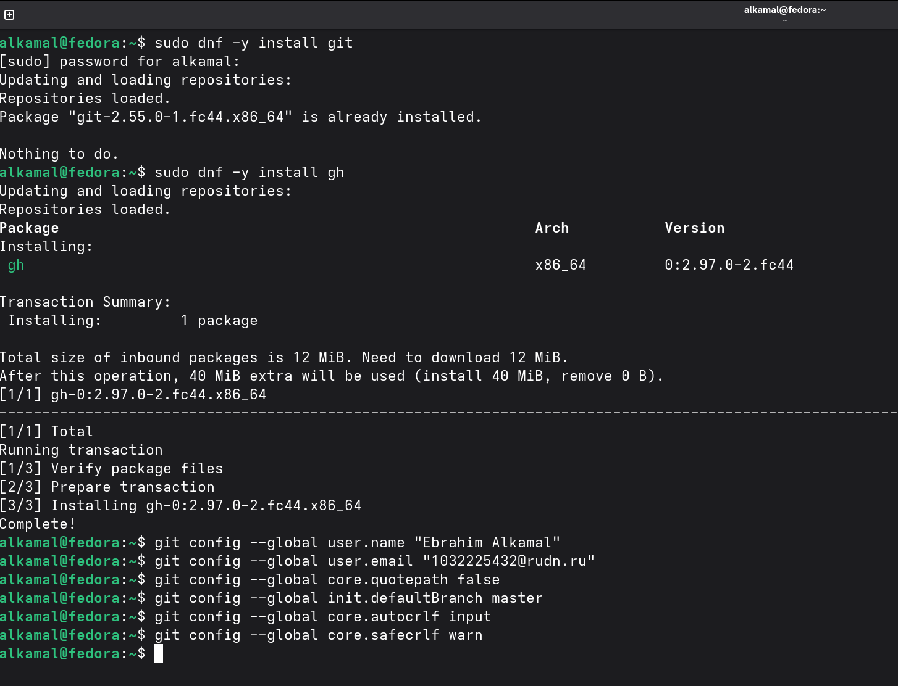{#fig-1 width=70%}

## Аутентификация на GitHub

- Выполнена аутентификация через GitHub CLI.
- Настроен протокол HTTPS для операций Git.

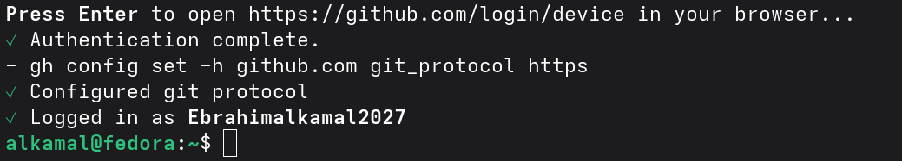{#fig-2 width=70%}

## Создание SSH-ключа

- Проверено состояние авторизации командой `gh auth status`.
- Создана пара SSH-ключей Ed25519.

{#fig-3 width=70%}

## Создание GPG-ключа

- Создан GPG-ключ с данными пользователя.
- Созданы открытый и секретный ключи.

{#fig-4 width=70%}

## Настройка GPG-подписания

- Проверен созданный GPG-ключ.
- Настроено автоматическое GPG-подписание коммитов.

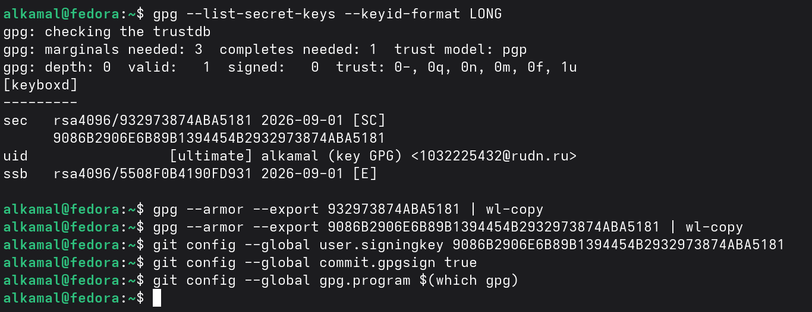{#fig-5 width=70%}

## Проверка инструментов

- Проверены установленные инструменты рабочего окружения.
- Подтверждено наличие `commitizen`, `cz-customizable` и `standard-version`.

{#fig-6 width=70%}

# Подготовка рабочего пространства лабораторной работы

## Клонирование репозитория

- Репозиторий курса клонирован с GitVerse по SSH.
- Создана локальная копия проекта.

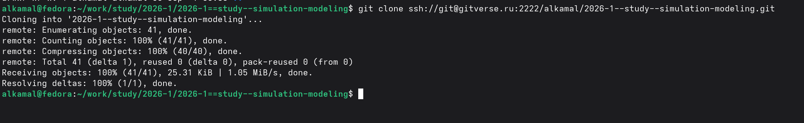{#fig-7 width=70%}

## Подготовка структуры проекта

- Выполнена команда `make prepare`.
- Загружены подмодули шаблонов презентации и отчёта.
- Проверена структура лабораторных работ.

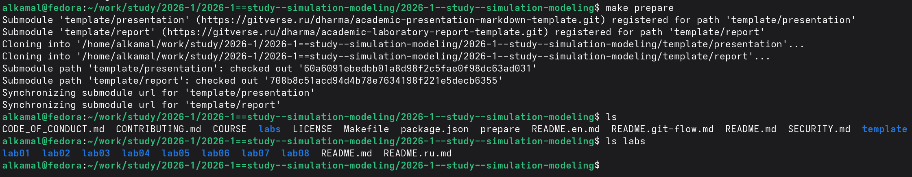{#fig-8 width=70%}

## Синхронизация с GitVerse

- Изменения отправлены в GitVerse.
- Ветка `master` синхронизирована с `origin/master`.
- Рабочее дерево не содержит изменений.

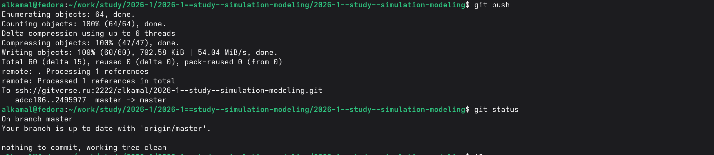{#fig-9 width=70%}

## Синхронизация с GitHub

- Ветка `master` отправлена в репозиторий GitHub.

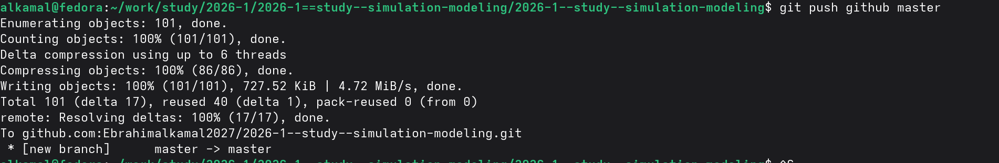{#fig-10 width=70%}

## Инициализация Git Flow

- Инициализирован Git Flow.
- Основная ветка — `master`.
- Ветка разработки — `develop`.
- Префикс тегов версий — `v`.

{#fig-11 width=70%}

## Создание релиза

- Ветки и тег `v1.0.0` отправлены в GitVerse и GitHub.
- Сформирован `CHANGELOG.md`.
- Создан релиз `v1.0.0`.

{#fig-12 width=70%}

# Создание и проверка проекта моделирования

## Создание проекта Julia

- Создан каталог `project`.
- Проверена структура проекта.
- Созданы каталоги `data`, `notebooks`, `plots`, `scripts`, `src` и `test`.

{#fig-13 width=70%}

## Установка зависимостей

- Установлены зависимости Julia.
- Выполнена предварительная компиляция пакетов.

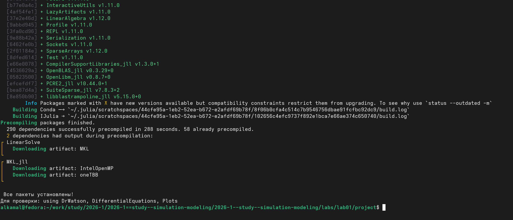{#fig-14 width=70%}

## Проверка окружения

- Выполнен `scripts/test_setup.jl`.
- Проверена доступность необходимых пакетов.
- Проверена структура каталогов проекта.

{#fig-15 width=70%}

# Реализация модели экспоненциального роста

## Выполнение модели

- Создан сценарий `01_exponential_growth.jl`.
- Получены первые значения решения модели.
- Рассчитано время удвоения: `2.31`.

{#fig-16 width=70%}

## Визуализация модели

- Построен график для `α = 0.3`.
- Получен экспоненциальный рост популяции во времени.

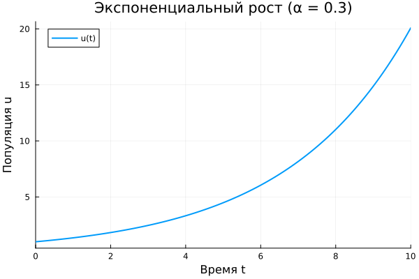{#fig-17 width=70%}

## Сохранение результатов

- Результаты сохранены в `all_results.jld2`.
- График сохранён в каталоге результатов.

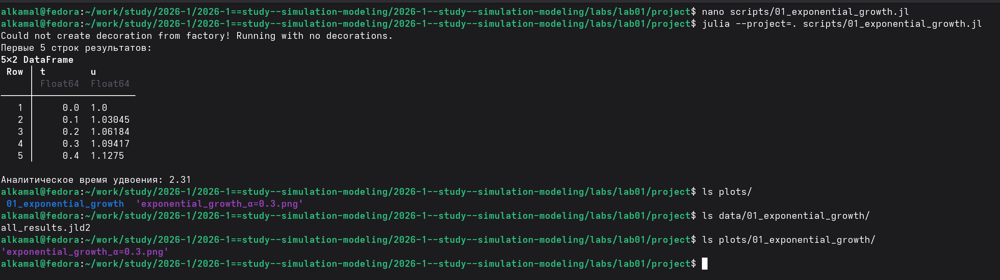{#fig-18 width=70%}

# Литературная реализация модели

## Генерация файлов

- Подготовлен сценарий `tangle.jl`.
- Сформирован чистый код Julia.
- Созданы документы `.qmd` и `.ipynb`.

{#fig-19 width=70%}

## Выполнение Jupyter Notebook

- Выполнен `01_exponential_growth.ipynb`.
- Получены график и таблица результатов.
- Получено время удвоения `2.31`.

{#fig-20 width=70%}

# Проведение вычислительного эксперимента

## Параметрическое сканирование

- Выполнен `02_exponential_growth.jl`.
- Базовый эксперимент проведён при `α = 0.3`.
- Исследованы `α = 0.1, 0.3, 0.5, 0.8, 1.0`.
- Результаты сведены в таблицу.

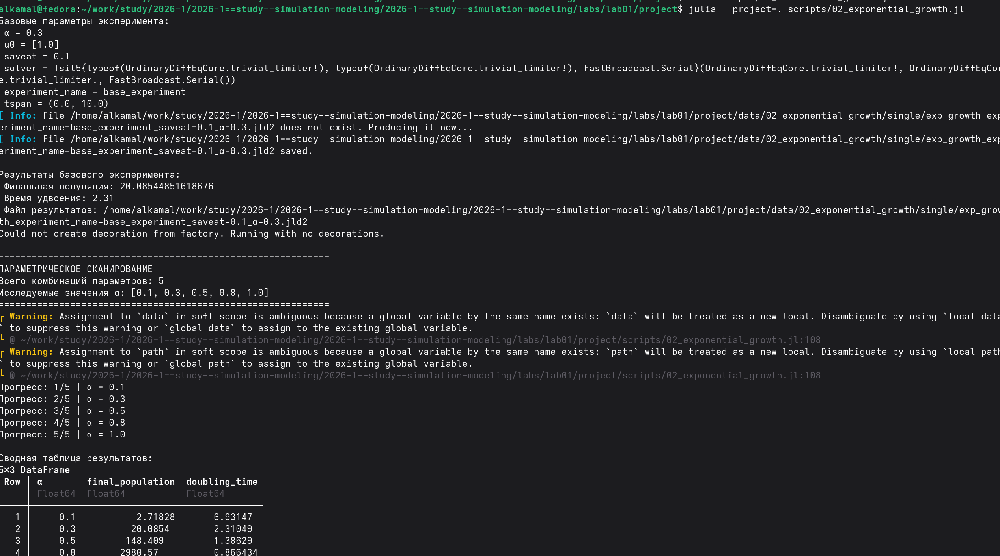{#fig-21 width=70%}

## Базовый эксперимент

- Построен график базового эксперимента при `α = 0.3`.

{width=70%}

## Сравнение параметров модели

- Выполнено сравнение результатов для различных `α`.
- Увеличение `α` приводит к более быстрому росту популяции.

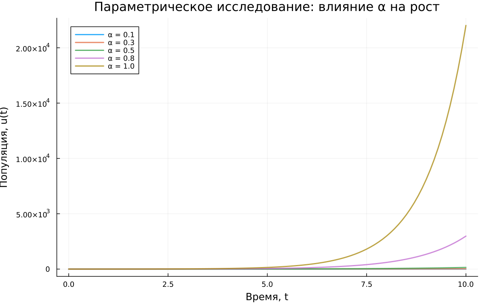{width=70%}

## Анализ времени удвоения

- Построена зависимость времени удвоения от `α`.
- Численные результаты сравнены с `t₂ = ln(2)/α`.
- При увеличении `α` время удвоения уменьшается.

{width=70%}

## Анализ времени вычисления

- Построена зависимость времени вычисления от `α`.
- Сравнено время вычислений для пяти значений параметра.

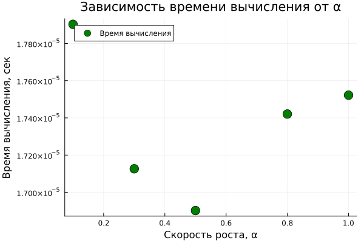{width=70%}

# Литературная реализация вычислительного эксперимента

## Генерация файлов эксперимента

- `02_exponential_growth.jl` преобразован с помощью `tangle.jl`.
- Создан чистый сценарий Julia.
- Созданы документ Quarto и Jupyter Notebook.

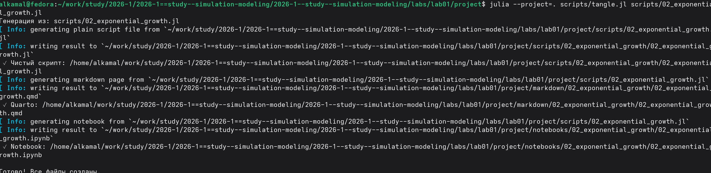{#fig-22 width=70%}

## Выполнение параметрического исследования

- Выполнен `02_exponential_growth.ipynb`.
- Получены результаты параметрического исследования.
- Выполнено сравнение численного и теоретического времени удвоения.

{#fig-23 width=70%}

# Выводы

- Подготовлено рабочее окружение.
- Настроены Git, GitHub и GitVerse.
- Создан и проверен проект Julia.
- Реализована модель экспоненциального роста.
- Проведено параметрическое исследование.
- При увеличении `α` рост популяции ускоряется.
- При увеличении `α` время удвоения уменьшается.
- Сформированы сценарии, документация Quarto и Jupyter Notebook.