---
## Author
author:
  name: Ибрахим Мохсейн Алькамаль
  degrees: Student (3 курс)
  orcid: ""
  email: 1032225432@rudn.ru
  affiliation:
    - name: Российский университет дружбы народов
      country: Российская Федерация
      postal-code: 117198
      city: Москва
      address: ул. Миклухо-Маклая, д. 6

## Title
title: "Отчёт по лабораторной работе №1"
subtitle: "Имитационное моделирование"
license: "CC BY"
---

# Цель работы

Подготовить рабочее окружение для имитационного моделирования, освоить организацию проекта на языке Julia и реализовать модель экспоненциального роста. Провести вычислительные эксперименты с различными значениями параметра роста и проанализировать полученные результаты.

# Выполнение лабораторной работы

## Настройка Git и средств аутентификации

В операционной системе Fedora была проверена установка Git и установлен GitHub CLI. После этого заданы глобальные параметры Git: имя и электронная почта пользователя, корректное отображение путей, ветка `master` по умолчанию, а также параметры обработки окончаний строк для Linux ([рис. @fig-1]). Эти настройки соответствуют этапу базовой настройки Git в лабораторной работе. 

{#fig-1 width=70%}

С помощью GitHub CLI была выполнена аутентификация на GitHub. В результате подтверждён успешный вход в учётную запись и настроено использование протокола HTTPS для операций Git ([рис. @fig-2]).

{#fig-2 width=70%}

После авторизации была выполнена проверка её состояния командой `gh auth status`. Затем создана отдельная пара SSH-ключей типа Ed25519, состоящая из закрытого и открытого ключей в каталоге `~/.ssh` ([рис. @fig-3]).

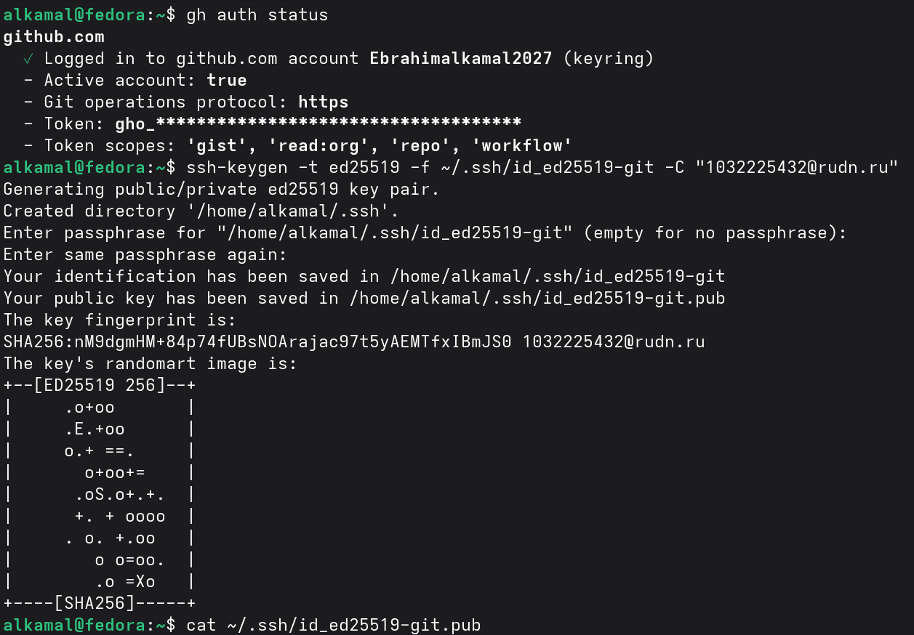{#fig-3 width=70%}

Для подписания коммитов был создан GPG-ключ с указанными данными пользователя. После генерации GPG сообщил об успешном создании открытого и секретного ключей, а также сертификата отзыва ([рис. @fig-4]).

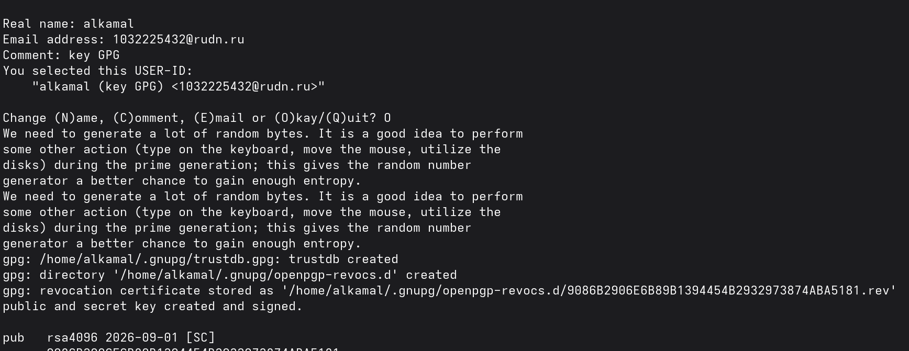{#fig-4 width=70%}

Созданный секретный GPG-ключ был выведен с помощью `gpg --list-secret-keys --keyid-format LONG`. Затем открытый ключ был экспортирован, а Git настроен на использование созданного ключа и автоматическое GPG-подписание коммитов ([рис. @fig-5]).

{#fig-5 width=70%}

В завершение была выполнена проверка установленных инструментов рабочего окружения. Получены версии Quarto, `libxcrypt-compat`, Node.js, Yarn, pnpm и Git Flow, а также подтверждено наличие глобально установленных пакетов `commitizen`, `cz-customizable` и `standard-version` ([рис. @fig-6]).

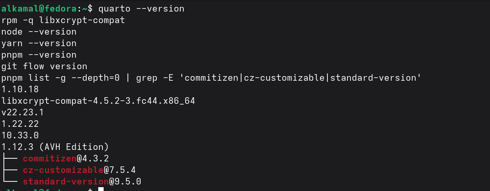{#fig-6 width=70%}

## Подготовка рабочего пространства лабораторной работы

Репозиторий курса был клонирован с GitVerse по протоколу SSH в локальный рабочий каталог. Вывод команды подтверждает успешное получение объектов репозитория и создание локальной копии проекта ([рис. @fig-7]).

{#fig-7 width=70%}

После клонирования была выполнена команда `make prepare`, которая подготовила структуру проекта и загрузила подмодули шаблонов презентации и отчёта. Проверка содержимого каталогов показала наличие лабораторных работ `lab01`–`lab08` и основных файлов проекта ([рис. @fig-8]).

{#fig-8 width=70%}

Подготовленные изменения были отправлены в удалённый репозиторий GitVerse командой `git push`. Последующая проверка `git status` показала, что локальная ветка `master` синхронизирована с `origin/master`, а рабочее дерево не содержит незакоммиченных изменений ([рис. @fig-9]).

{#fig-9 width=70%}

Для хранения копии проекта на GitHub ветка `master` была отправлена в настроенный удалённый репозиторий `github`. Результат выполнения команды подтверждает успешное создание ветки `master` в репозитории GitHub ([рис. @fig-10]).

{#fig-10 width=70%}

Для организации процесса разработки в репозитории был инициализирован Git Flow. В качестве основной ветки выбрана `master`, а для разработки следующей версии — `develop`; также сохранены стандартные префиксы вспомогательных веток и задан префикс `v` для тегов версий ([рис. @fig-11]).

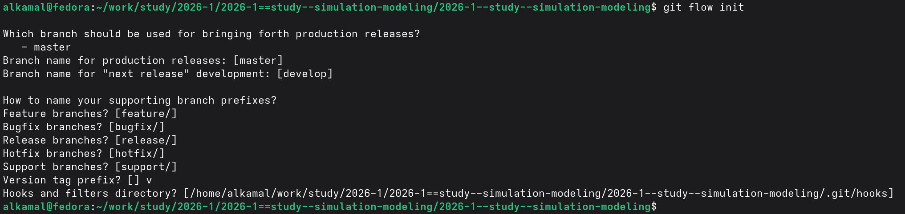{#fig-11 width=70%}

После подготовки репозитория ветки `master` и `develop`, а также тег версии `v1.0.0` были отправлены в GitVerse и GitHub. Для версии `v1.0.0` сформирован файл `CHANGELOG.md` и создан релиз; его содержимое было выведено в терминале для проверки ([рис. @fig-12]).

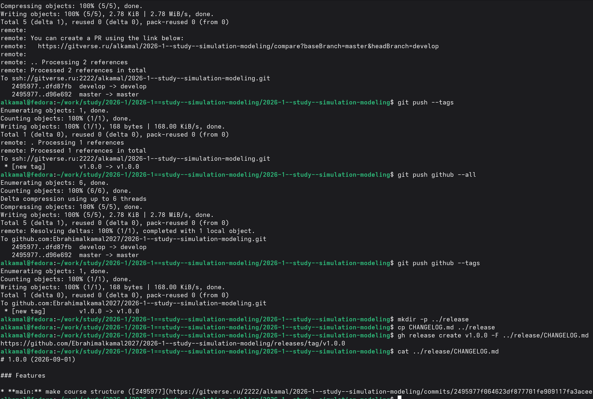{#fig-12 width=70%}

## Создание и проверка проекта моделирования

С помощью подготовленного сценария был создан каталог `project` для выполнения лабораторной работы. Проверка содержимого показала наличие основных каталогов проекта, включая `data`, `notebooks`, `plots`, `scripts`, `src` и `test`, а также файлов `Project.toml` и `Manifest.toml` ([рис. @fig-13]).

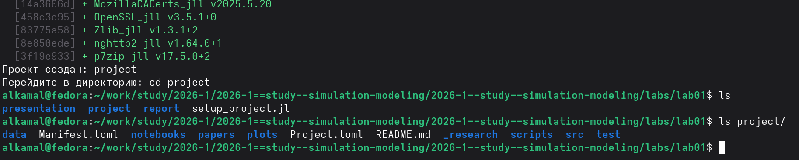{#fig-13 width=70%}

После создания проекта была завершена установка и предварительная компиляция необходимых зависимостей Julia. Вывод команды подтверждает успешную установку пакетов и завершение их предварительной компиляции ([рис. @fig-14]).

{#fig-14 width=70%}

Для проверки подготовленного окружения был выполнен сценарий `scripts/test_setup.jl` с активным проектом Julia. Проверка подтвердила доступность требуемых пакетов, включая `DrWatson`, `DifferentialEquations`, `Plots`, `DataFrames`, `CSV`, `JLD2`, `Literate`, `IJulia`, `BenchmarkTools` и `Quarto`, а также вывела структуру каталогов проекта ([рис. @fig-15]).

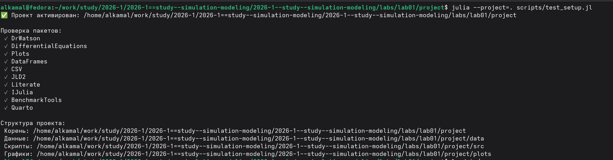{#fig-15 width=70%}

## Реализация модели экспоненциального роста

В каталоге `scripts` был создан сценарий `01_exponential_growth.jl` и выполнен в окружении проекта. В результате получены первые значения решения модели и рассчитано аналитическое время удвоения, равное `2.31`. Также сформирован графический файл результата ([рис. @fig-16]).

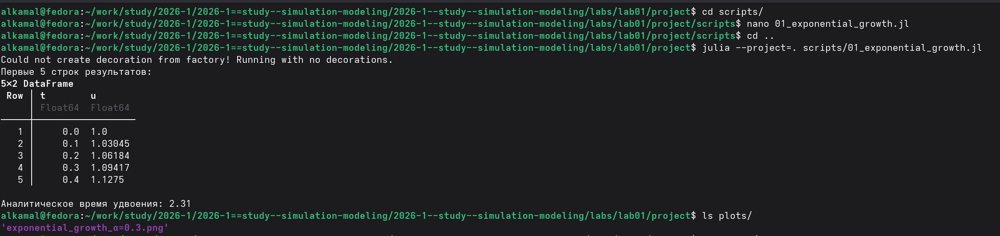{#fig-16 width=70%}

Полученный график показывает изменение популяции `u` во времени `t` для параметра `α = 0.3`. На представленном интервале наблюдается экспоненциальное увеличение значения моделируемой величины ([рис. @fig-17]).

{#fig-17 width=70%}

После выполнения модели была проверена структура сформированных результатов. Файл `all_results.jld2` сохранён в каталоге данных, а график `exponential_growth_α=0.3.png` — в соответствующем каталоге результатов визуализации ([рис. @fig-18]).

{#fig-18 width=70%}

## Создание производных форматов

Для преобразования исходного сценария был подготовлен файл `tangle.jl`. Его выполнение для `01_exponential_growth.jl` сформировало чистый сценарий Julia, документацию Quarto в формате `.qmd` и Jupyter Notebook в формате `.ipynb`. Наличие созданных файлов было проверено в соответствующих каталогах проекта ([рис. @fig-19]).

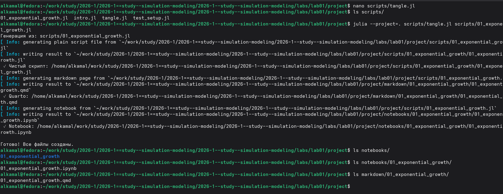{#fig-19 width=70%}

## Генерация файлов литературной реализации 



Сгенерированный файл `01_exponential_growth.ipynb` был открыт и выполнен в Jupyter Notebook. Результаты выполнения включают график экспоненциального роста, таблицу первых значений решения и рассчитанное аналитическое время удвоения `2.31` ([рис. @fig-20]).

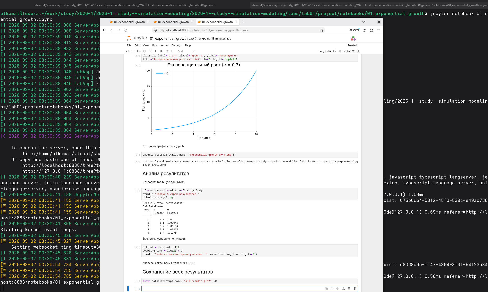{#fig-20 width=70%}

##  Реализация модели с параметрами

Для расширенного исследования модели был выполнен сценарий `02_exponential_growth.jl`. Сначала проведён базовый эксперимент при `α = 0.3`, после чего выполнено параметрическое сканирование для пяти значений `α`: `0.1`, `0.3`, `0.5`, `0.8` и `1.0`. Результаты экспериментов были сведены в таблицу с конечной популяцией и временем удвоения ([рис. @fig-21]).

{#fig-21 width=70%}

Для базового эксперимента при `α = 0.3` построена зависимость популяции `u(t)` от времени. График демонстрирует увеличение моделируемой величины на рассматриваемом временном интервале.

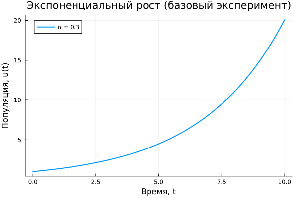{width=70%}

Сравнение результатов для исследуемых значений `α` показывает, что увеличение параметра скорости роста приводит к более быстрому увеличению популяции. Наиболее интенсивный рост наблюдается при `α = 1.0`.

{width=70%}

По результатам параметрического исследования построена зависимость времени удвоения от `α`. Численные значения представлены вместе с теоретической зависимостью `t₂ = ln(2)/α` и демонстрируют уменьшение времени удвоения при увеличении `α`.

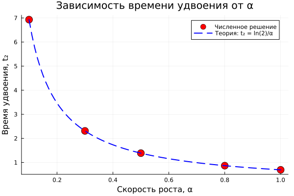{width=70%}

Дополнительно построена зависимость времени вычисления от значения `α`. Полученные точки позволяют сравнить продолжительность вычислений для пяти исследованных значений параметра.

{width=70%}

## Литературная реализация вычислительного эксперимента

Сценарий `02_exponential_growth.jl` был преобразован в литературном стиле с помощью `tangle.jl`. В результате автоматически сформированы чистый сценарий Julia, документация Quarto в формате `.qmd` и Jupyter Notebook в формате `.ipynb` ([рис. @fig-22]).

{#fig-22 width=70%}

Сгенерированный файл `02_exponential_growth.ipynb` был открыт и выполнен в Jupyter Notebook. В ноутбуке получены результаты параметрического исследования, в том числе зависимость времени удвоения от параметра `α` и её сравнение с теоретической зависимостью `t₂ = ln(2)/α` ([рис. @fig-23]).

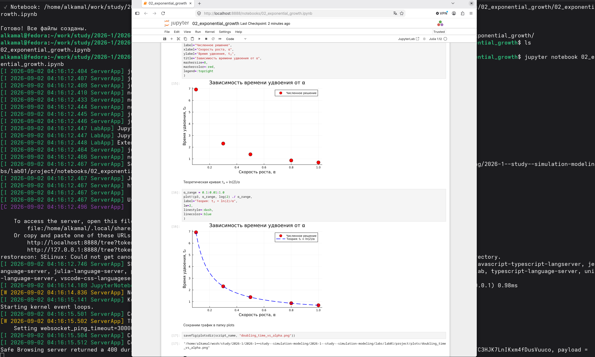{#fig-23 width=70%}



## Выводы

В ходе лабораторной работы была подготовлена рабочая среда, настроены Git, GitHub и GitVerse, создан и проверен проект Julia. Реализована модель экспоненциального роста и проведено параметрическое исследование для различных значений `α`. Полученные результаты показали, что с увеличением `α` популяция растёт быстрее, а время её удвоения уменьшается. Также были сформированы чистые сценарии, документация Quarto и Jupyter Notebook, в котором выполнены разработанные модели.

