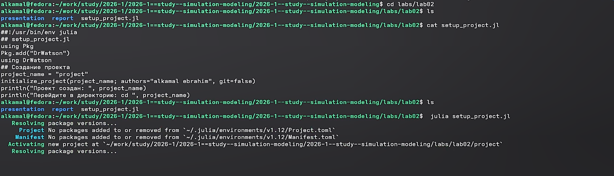
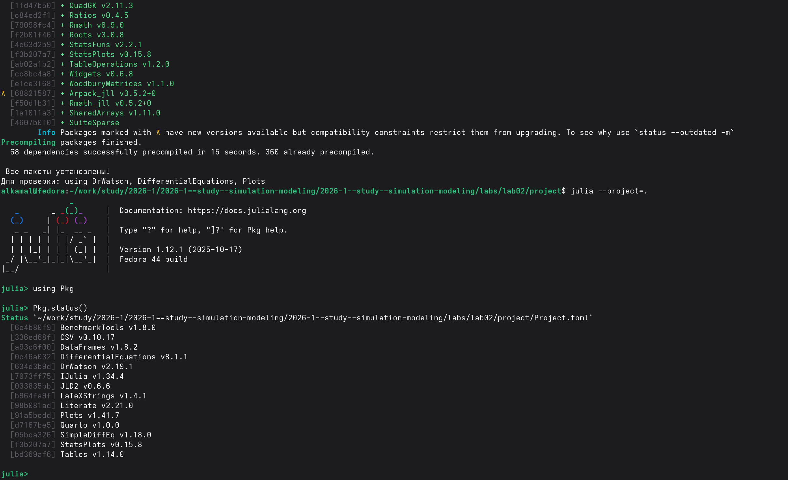
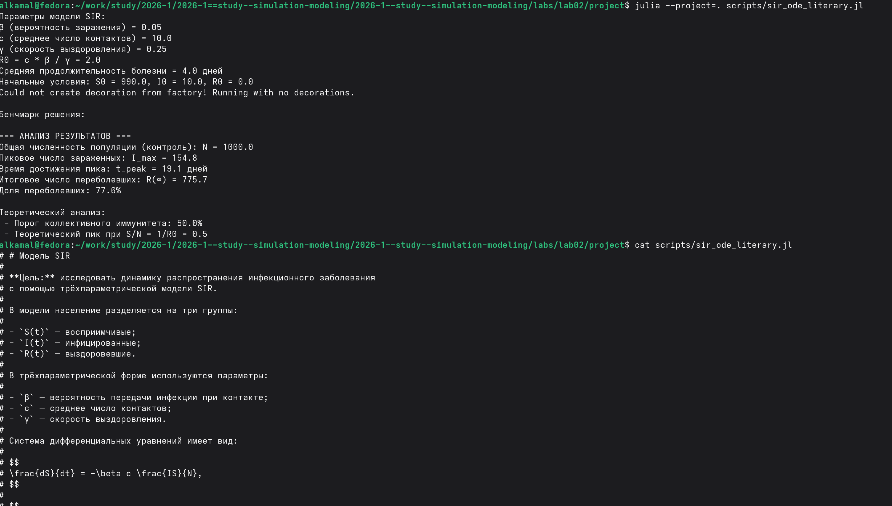
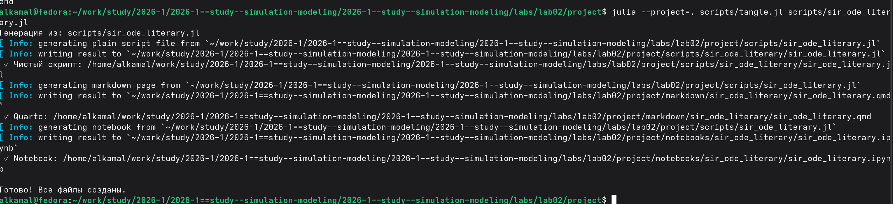
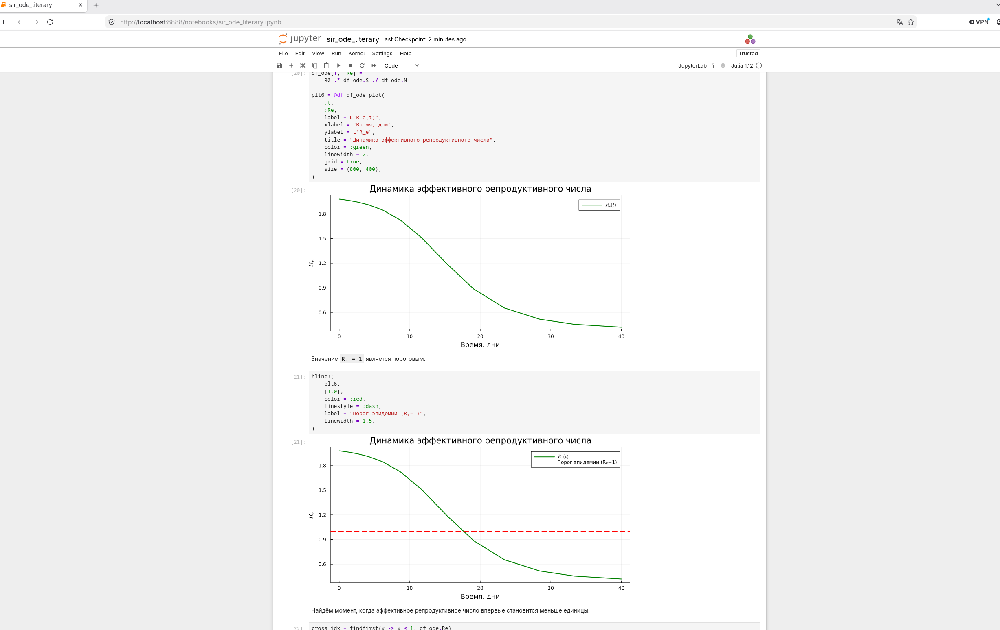
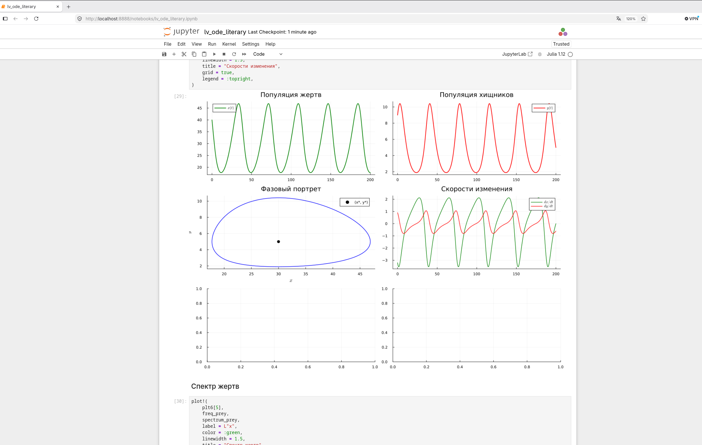

---
## Author
author:
  name: Ибрахим Мохсейн Алькамаль
  degrees: Student (3 курс)
  orcid: ""
  email: 1032225432@rudn.ru
  affiliation:
    - name: Российский университет дружбы народов
      country: Российская Федерация
      postal-code: 117198
      city: Москва
      address: ул. Миклухо-Маклая, д. 6
## Title
title: Лабораторная работа №2
subtitle: Имитационное моделирование
license: CC BY
date: today
date-format: "YYYY-MM-DD" # Example: 2025-09-06
---

# Информация

## Докладчик

:::::::::::::: {.columns align=center}
::: {.column width="70%"}

  - Ибрахим Мохсейн Алькамаль
  - Российский университет дружбы народов

:::
::: {.column width="30%"}

:::
::::::::::::::

# Цель работы

- Изучить основные модели, описываемые системами дифференциальных уравнений.
- Реализовать модели SIR и Лотки–Вольтерры средствами Julia.
- Выполнить численное моделирование и анализ полученных результатов.

# Выполнение лабораторной работы

## Подготовка проекта

- Выполнен переход в каталог лабораторной работы `lab02`.
- Проверено содержимое каталога.
- Запущен скрипт `setup_project.jl`.
- Создано окружение проекта.

{#fig-1 width=70%}

## Установка и проверка пакетов Julia

- Установлены необходимые пакеты проекта.
- Выполнена предварительная компиляция зависимостей.
- Активировано окружение проекта.
- Командой `Pkg.status()` проверен список установленных пакетов.

{#fig-2 width=70%}

# Модель SIR

## Запуск модели SIR

- Запущен скрипт `sir_ode.jl`.
- Заданы параметры: $\beta=0.05$, $c=10$, $\gamma=0.25$.
- Получено базовое репродуктивное число $R_0=2$.
- Начальные условия: $S_0=990$, $I_0=10$, $R_0=0$.
- Пиковое число заражённых составляет $154.8$ на $19.1$ день.
- Итоговая доля переболевших составляет $77.6\%$.

{#fig-3 width=70%}

## Подготовка литературного скрипта SIR

- Выполнен запуск `sir_ode_literary.jl`.
- Проверено описание трёхпараметрической модели SIR.
- В модели используются группы $S(t)$, $I(t)$ и $R(t)$.

{#fig-4 width=70%}

## Генерация файлов модели SIR

- Скрипт обработан программой `tangle.jl`.
- Создан чистый Julia-скрипт.
- Создан документ Quarto.
- Создан Jupyter Notebook.

{#fig-5 width=70%}

## Анализ эффективного репродуктивного числа

- Jupyter Notebook используется для анализа модели SIR.
- Построена динамика эффективного репродуктивного числа $R_e(t)$.
- На график добавлен порог эпидемии $R_e=1$.
- В процессе моделирования $R_e(t)$ уменьшается ниже порогового значения.

{#fig-6 width=70%}

# Модель Лотки–Вольтерры

## Запуск модели Лотки–Вольтерры

- Запущен скрипт `lv_ode.jl`.
- Заданы параметры модели $\alpha=0.1$, $\beta=0.02$, $\delta=0.01$, $\gamma=0.3$.
- Начальные условия: $x_0=40$, $y_0=9$.
- Получены стационарные точки $x^*=30$ и $y^*=5$.
- Определены статистические характеристики популяций.

{#fig-7 width=70%}

## Подготовка литературного скрипта Лотки–Вольтерры

- Запущен литературный скрипт `lv_ode_literary.jl`.
- Получены параметры и начальные условия модели.
- Определены стационарные точки.
- Выполнен анализ колебаний популяций.

{#fig-8 width=70%}

## Генерация файлов модели Лотки–Вольтерры

- Скрипт обработан программой `tangle.jl`.
- Создан чистый Julia-скрипт.
- Сформирован документ Quarto.
- Создан Jupyter Notebook.

{#fig-9 width=70%}

## Анализ динамики популяций

- В Jupyter Notebook построена динамика популяции жертв.
- Построена динамика популяции хищников.
- Получен фазовый портрет системы.
- Представлены скорости изменения популяций.
- Наблюдаются периодические колебания численности жертв и хищников.

{#fig-10 width=70%}

# Выводы

- Реализованы модели SIR и Лотки–Вольтерры.
- Выполнено численное моделирование средствами Julia.
- Для модели SIR исследована динамика распространения инфекции и эффективного репродуктивного числа.
- Для модели Лотки–Вольтерры исследованы колебания популяций жертв и хищников.
- Результаты представлены и проанализированы в Jupyter Notebook.