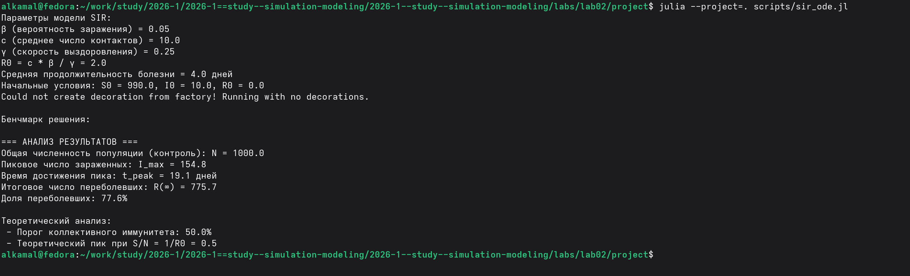
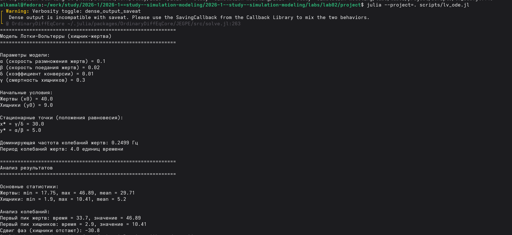
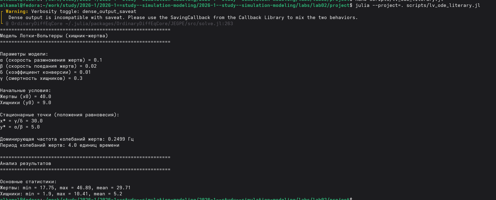
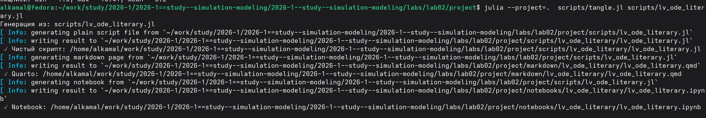

---
## Author
author:
  name: Ибрахим Мохсейн Алькамаль
  degrees: Student (3 курс)
  orcid: ""
  email: 1032225432@rudn.ru
  affiliation:
    - name: Российский университет дружбы народов
      country: Российская Федерация
      postal-code: 117198
      city: Москва
      address: ул. Миклухо-Маклая, д. 6

## Title
title: "Отчёт по лабораторной работе №2"
subtitle: "Имитационное моделирование"
license: "CC BY"
---

# Цель работы

Изучить основные математические модели, реализуемые в виде систем обыкновенных дифференциальных уравнений, и освоить их численное моделирование средствами Julia. Исследовать динамику модели SIR и модели Лотки–Вольтерры, выполнить анализ полученных результатов и их визуализацию

# Выполнение лабораторной работы

## Подготовка рабочего окружения

Для выполнения лабораторной работы был подготовлен отдельный проект `lab02/project`. Сценарий `setup_project.jl` использован для создания структуры проекта и активации рабочего окружения Julia ([рис. @fig-1]).

{#fig-1 width=70%}

После создания проекта были установлены необходимые зависимости. Проверка окружения с помощью `Pkg.status()` показала наличие пакетов, используемых для моделирования, обработки данных, построения графиков и подготовки литературного кода ([рис. @fig-2]).

{#fig-2 width=70%}

## Выполнение модели SIR

Исходный программный код модели SIR был выполнен командой `julia --project=. scripts/sir_ode.jl`. Для расчёта использовались параметры $\beta=0.05$, $c=10.0$ и $\gamma=0.25$, при которых базовое репродуктивное число составляет $R_0=2.0$. В результате моделирования максимальное число заражённых составило 154.8 человека и было достигнуто примерно на 19.1-й день ([рис. @fig-3]).

{#fig-3 width=70%}

## Преобразование модели SIR в литературный стиль

Программный код модели был преобразован в литературный формат `sir_ode_literary.jl`. В литературном представлении приведены описание модели, группы $S(t)$, $I(t)$ и $R(t)$, используемые параметры и система дифференциальных уравнений. Выполнение литературного сценария подтвердило получение результатов модели SIR ([рис. @fig-4]).

{#fig-4 width=70%}

## Генерация файлов из литературного кода

С помощью сценария `tangle.jl` из файла `sir_ode_literary.jl` были автоматически сформированы чистый программный код, документация Quarto и Jupyter Notebook. Сгенерированные файлы размещены в соответствующих каталогах `scripts`, `markdown` и `notebooks` проекта ([рис. @fig-5]).

{#fig-5 width=70%}

## Выполнение Jupyter Notebook

Сгенерированный Jupyter Notebook `sir_ode_literary.ipynb` был выполнен в среде Julia. В ходе выполнения построен график изменения эффективного репродуктивного числа $R_e(t)$ и показан порог эпидемии $R_e=1$ ([рис. @fig-6]).

{#fig-6 width=70%}



## Выполнение модели Лотки–Вольтерры

Модель Лотки–Вольтерры была выполнена командой `julia --project=. scripts/lv_ode.jl`. Использовались параметры $\alpha=0.1$, $\beta=0.02$, $\delta=0.01$ и $\gamma=0.3$ при начальных условиях: 40 жертв и 9 хищников. Расчёт показал стационарную точку $(x^*,y^*)=(30,5)$ и периодический характер изменения популяций ([рис. @fig-7]).

{#fig-7 width=70%}

## Выполнение литературной версии модели

Литературная версия `lv_ode_literary.jl` была выполнена в активном окружении проекта. Получены параметры модели, стационарные точки и основные статистические характеристики популяций. Для жертв значения изменялись от 17.75 до 46.89, а для хищников — от 1.9 до 10.41 ([рис. @fig-8]).

{#fig-8 width=70%}

## Генерация файлов литературной программы

С помощью сценария `tangle.jl` из файла `lv_ode_literary.jl` были сформированы чистый программный файл, документ Quarto и Jupyter Notebook. Результаты сохранены в соответствующих каталогах `scripts`, `markdown` и `notebooks` ([рис. @fig-9]).

{#fig-9 width=70%}

## Выполнение Jupyter Notebook

Сгенерированный Jupyter Notebook `lv_ode_literary.ipynb` был выполнен для визуального анализа модели. Получены графики динамики популяций жертв и хищников, фазовый портрет и скорости изменения популяций ([рис. @fig-10]).

{#fig-10 width=70%}



# Выводы

В ходе лабораторной работы были реализованы и исследованы модели SIR и Лотки–Вольтерры. Для модели SIR была проанализирована динамика распространения инфекции и изменение эффективного репродуктивного числа. Для модели Лотки–Вольтерры исследованы колебания численности популяций жертв и хищников, определены стационарные точки и основные характеристики колебаний. Результаты моделирования были представлены графически и проанализированы в Jupyter Notebook.