---
## Author
author:
  name: Ибрахим Мохсейн Алькамаль
  degrees: Student (3 курс)
  orcid: ""
  email: 1032225432@rudn.ru
  affiliation:
    - name: Российский университет дружбы народов
      country: Российская Федерация
      postal-code: 117198
      city: Москва
      address: ул. Миклухо-Маклая, д. 6
## Title
title: Лабораторная работа №3
subtitle: Имитационное моделирование
license: CC BY
date: today
date-format: "YYYY-MM-DD" # Example: 2025-09-06
---

# Информация

## Докладчик

:::::::::::::: {.columns align=center}
::: {.column width="70%"}

  - Ибрахим Мохсейн Алькамаль
  - Российский университет дружбы народов

:::
::: {.column width="30%"}

:::
::::::::::::::

# Цель работы

- Изучить принципы агентного моделирования на примере Daisyworld.
- Реализовать взаимодействие чёрных и белых маргариток с окружающей средой.
- Исследовать динамику модели.
- Провести эксперименты с различными параметрами.
- Проанализировать численность агентов, температуру и солнечную светимость.

# Выполнение лабораторной работы

## Инициализация проекта

- Подготовлен проект `lab03/project`.
- Выполнен скрипт `setup_project.jl`.
- Инициализирована структура проекта.
- Установлены необходимые зависимости.

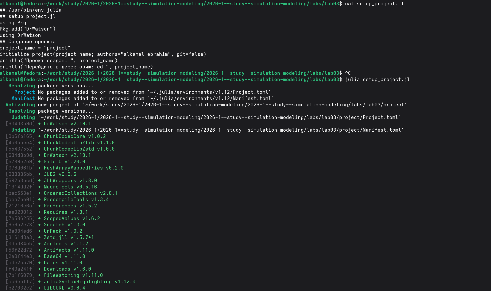{#fig-1 width=70%}

## Проверка проектного окружения

- Окружение активировано командой `julia --project=.`.
- Установленные пакеты проверены с помощью `Pkg.status()`.
- Проверено наличие `Agents`, `CairoMakie`, `DrWatson` и `DataFrames`.

{#fig-2 width=70%}

## Создание файлов модели

- Создан файл `src/daisyworld.jl`.
- Создан скрипт `scripts/daisyworld.jl`.
- Реализована базовая визуализация Daisyworld.

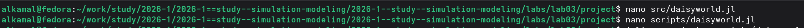{#fig-3 width=70%}

## Базовая визуализация

- Выполнен скрипт `scripts/daisyworld.jl`.
- Получены состояния модели на шагах 1, 5 и 40.
- Изображения сохранены в каталоге `plots/`.

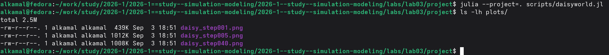{#fig-4 width=70%}

## Генерация файлов

- Подготовлен `scripts/daisyworld_literary.jl`.
- Выполнена обработка с помощью `tangle.jl`.
- Сформированы Julia-скрипт, Quarto-документ и Jupyter Notebook.

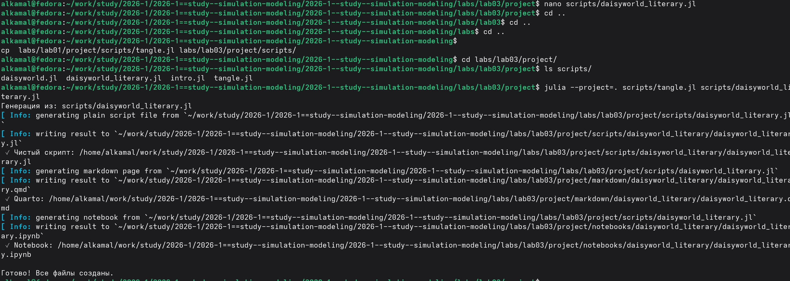{#fig-5 width=70%}

## Базовая модель в Jupyter

- Выполнен `daisyworld_literary.ipynb`.
- Инициализирована модель Daisyworld.
- Настроено отображение агентов.
- Заданы параметры температурной карты.

{#fig-6 width=70%}

## Скрипт анимации

- Подготовлен `scripts/daisyworld-animate.jl`.
- Настроено отображение агентов и температурного поля.
- Функция `abmvideo` формирует анимацию из 60 кадров.

{#fig-7 width=70%}

## Генерация анимации

- Выполнен `scripts/daisyworld-animate.jl`.
- Использовано активное проектное окружение.

{#fig-8 width=70%}

## Результат анимации

- Показана динамика Daisyworld во времени.
- Отображены агенты модели.
- Представлено температурное поле от −20 до 60.

{#fig-9 width=70%}

## Подготовка скриптов

- Подготовлены `daisyworld-count.jl` и `daisyworld-count_literary.jl`.
- Выполнена обработка литературной версии через `tangle.jl`.
- Созданы Julia-скрипт, Quarto-документ и Jupyter Notebook.

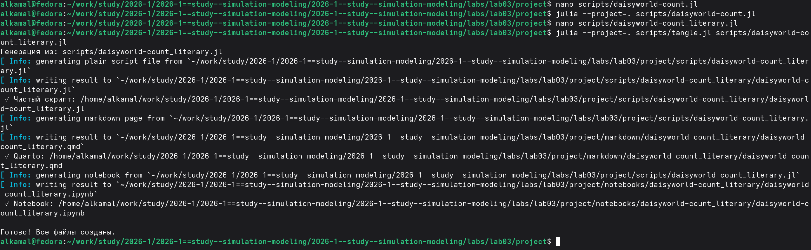{#fig-10 width=70%}

## Сбор данных

- Сформирован набор данных для чёрных и белых маргариток.
- Начальная солнечная светимость — `1.0`.
- Выполнено 1000 модельных шагов.
- Результаты сохранены в `agent_df`.

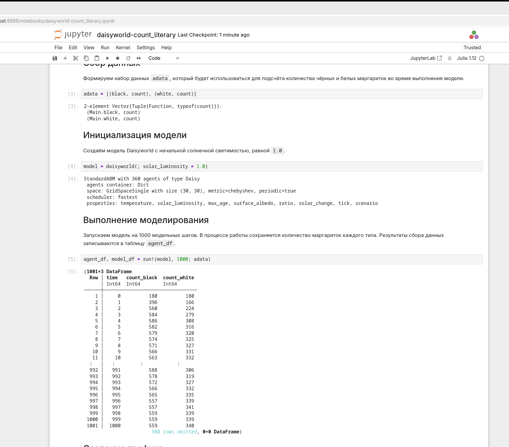{#fig-11 width=70%}

## Подготовка литературного скрипта

- Подготовлен `daisyworld-luminosity_literary.jl`.
- Выполнен `tangle.jl`.
- Созданы Julia-скрипт, Quarto-документ и Jupyter Notebook.

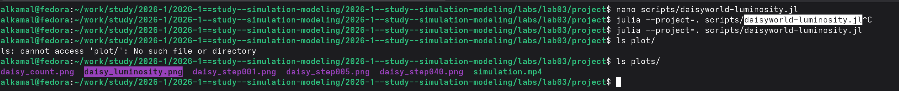{#fig-12 width=70%}

## Анализ динамики

- Построены три связанных графика.
- Отображена численность чёрных и белых маргариток.
- Показаны температура и солнечная светимость.
- Сопоставлена динамика с параметром `solar_luminosity`.

{#fig-13 width=70%}

## Серия экспериментов

- Подготовлен скрипт `daisyworld__param.jl`.
- Проведены эксперименты с различными параметрами.
- Результаты сохранены в каталоге `plots/`.

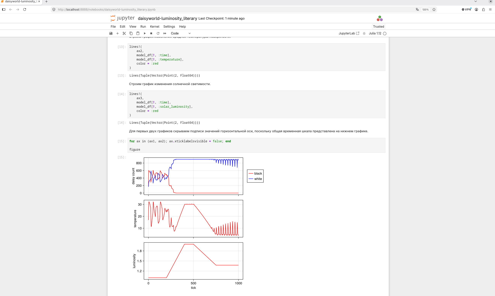{#fig-14 width=70%}

## Литературная версия экспериментов

- Создан `daisyworld__param_literary.jl`.
- Выполнена обработка с помощью `tangle.jl`.
- Созданы Julia-скрипт, Quarto-документ и Jupyter Notebook.

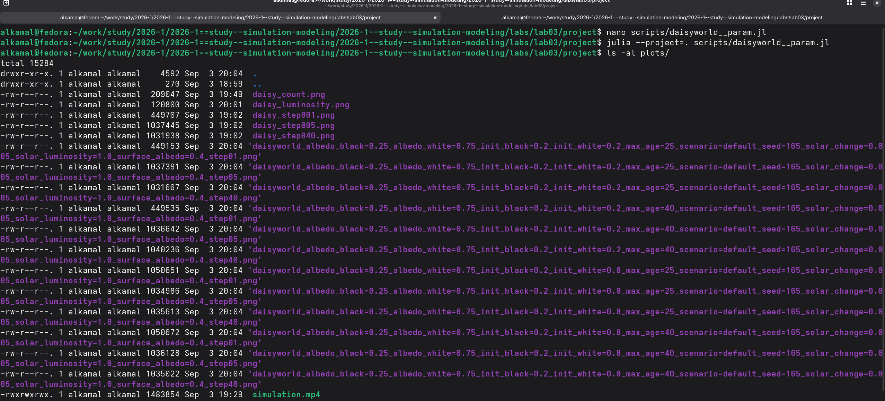{#fig-15 width=70%}

## Перебор параметров

- Последовательно перебираются наборы параметров.
- Для каждого набора создаётся отдельная модель.
- Состояние сохраняется на шагах 1, 5 и 40.
- Изменяются `max_age` и `init_white`.

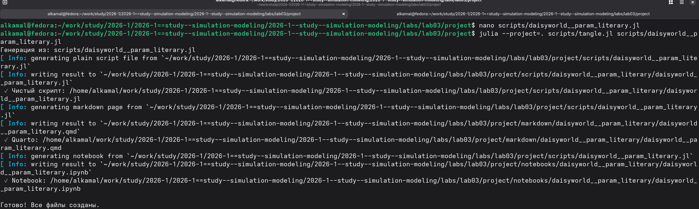{#fig-16 width=70%}

## Моделирование солнечной светимости

- Выполнен скрипт `daisyworld-luminosity.jl`.
- Получен график `daisy_luminosity.png`.
- Результат сохранён в каталоге `plots/`.

{#fig-17 width=70%}

## Настройка эксперимента

- Исследуются несколько комбинаций параметров.
- Анализируется численность чёрных и белых маргариток.
- Анализируются температура и солнечная светимость.
- Выполняется 1000 шагов со сценарием `:ramp`.

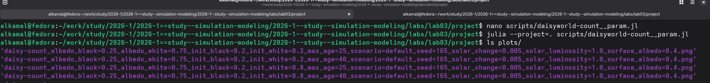{#fig-18 width=70%}

## Анализ численности агентов

- Выполнен `daisyworld-count__param.jl`.
- Исследованы комбинации `max_age` и `init_white`.
- Сформированы четыре графических результата.

{#fig-19 width=70%}

## Документирование анализа

- Подготовлен `daisyworld-count__param_literary.jl`.
- Выполнен `tangle.jl`.
- Сформированы Julia-скрипт, Quarto-документ и Jupyter Notebook.

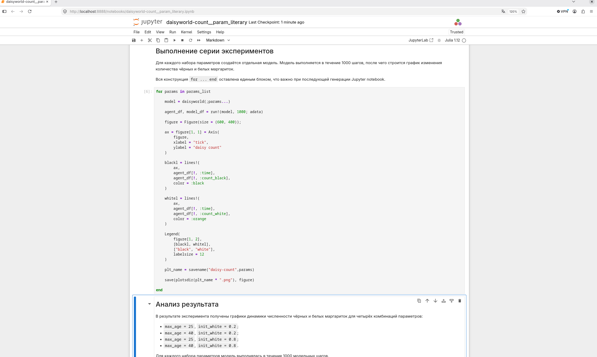{#fig-20 width=70%}

## Параметрические эксперименты

- Для каждого набора создаётся отдельная модель.
- Выполняется 1000 шагов моделирования.
- Строятся графики численности маргариток.
- Рассматриваются четыре комбинации `max_age` и `init_white`.

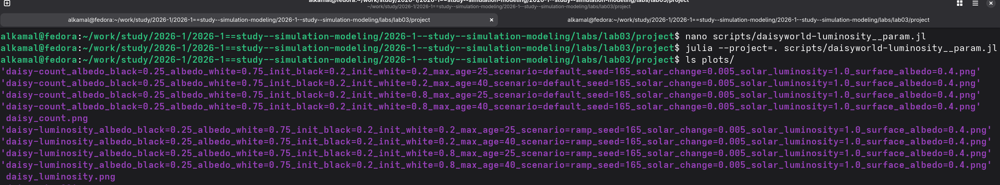{#fig-21 width=70%}

## Исследование солнечной светимости

- Выполнен `daisyworld-luminosity__param.jl`.
- Использованы различные комбинации `max_age` и `init_white`.
- Использован сценарий `ramp`.
- Сформированы четыре результата.

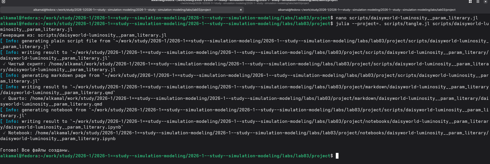{#fig-22 width=70%}

## Литературная версия исследования

- Подготовлен `daisyworld-luminosity__param_literary.jl`.
- Выполнена обработка через `tangle.jl`.
- Сформированы Julia-скрипт, Quarto-документ и Jupyter Notebook.

{#fig-23 width=70%}

# Выводы

- Реализована и исследована агентная модель Daisyworld.
- Выполнена визуализация состояния модели.
- Создана анимация динамики Daisyworld.
- Проведён сбор данных о численности маргариток.
- Исследовано изменение солнечной светимости.
- Рассмотрены различные значения `max_age` и `init_white`.
- Результаты представлены в виде графиков и Jupyter Notebook.