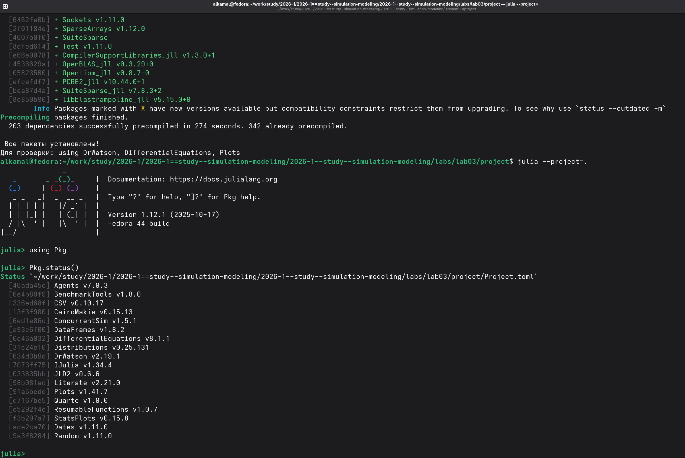
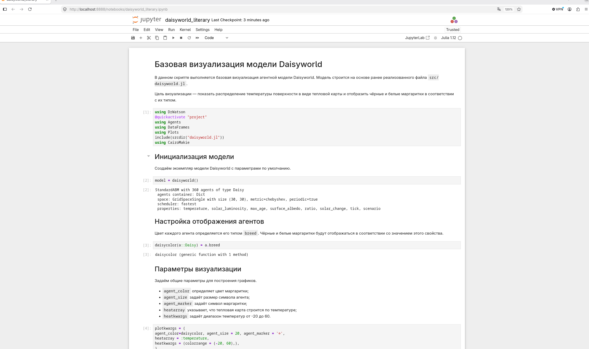
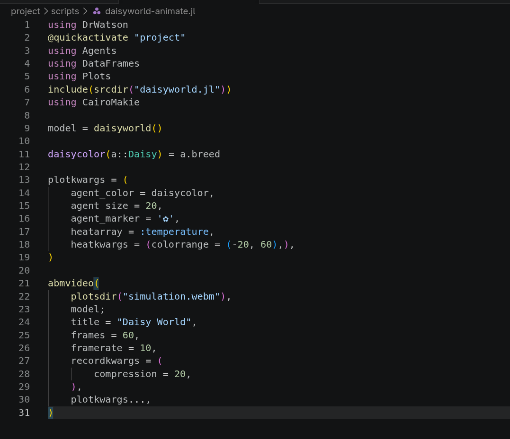
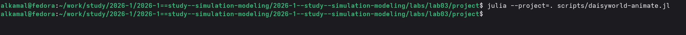
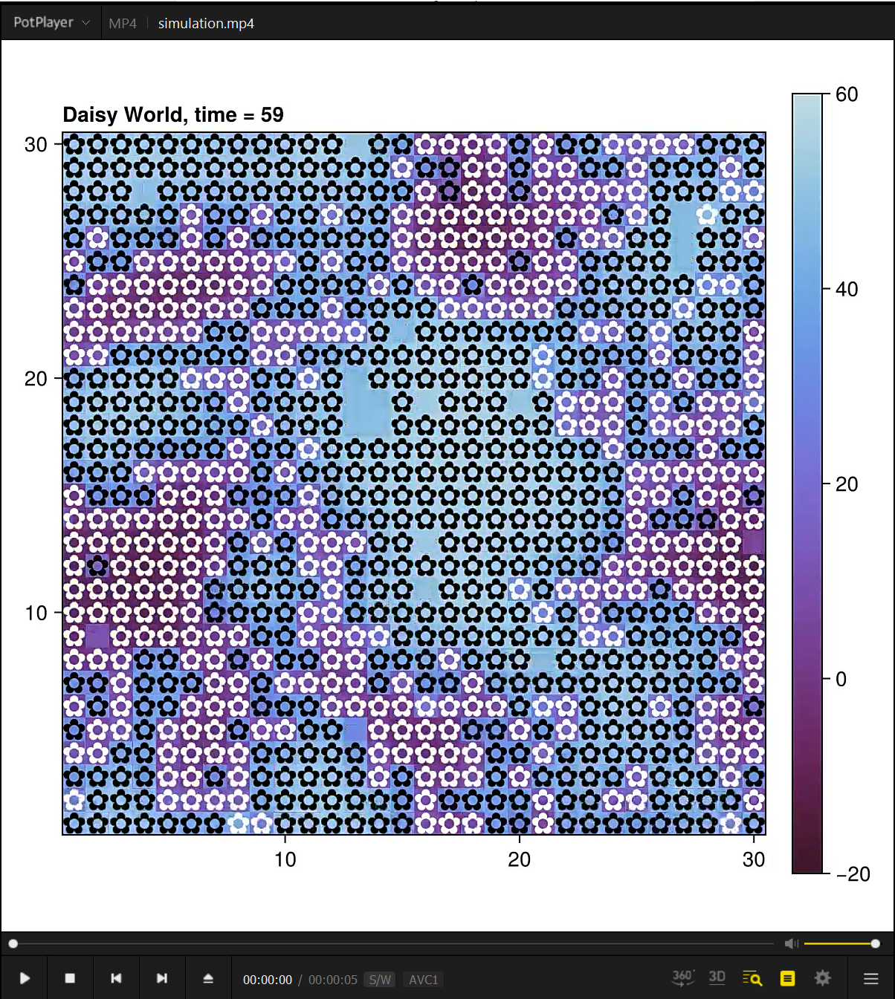
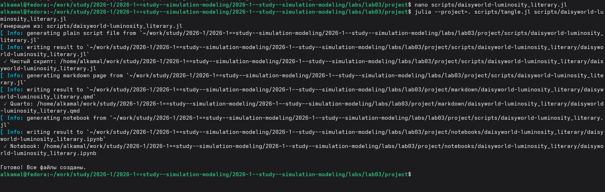
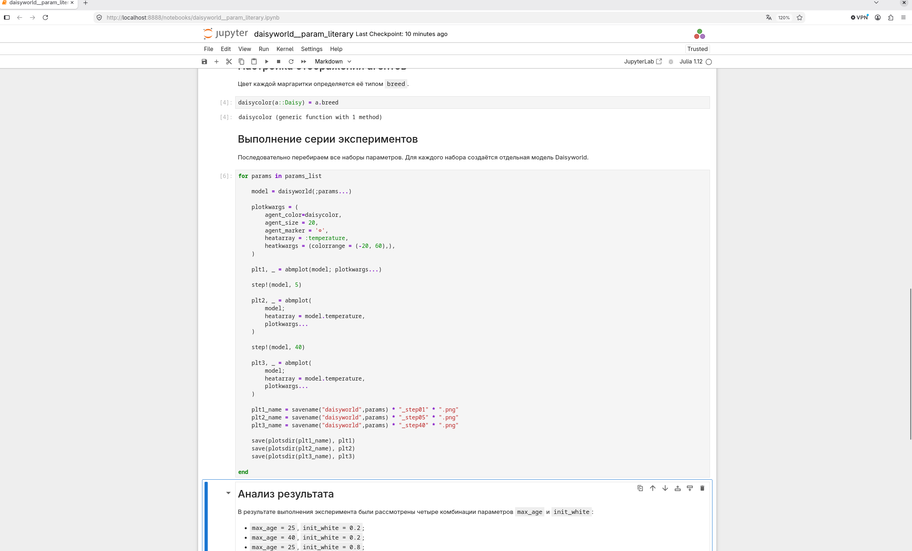
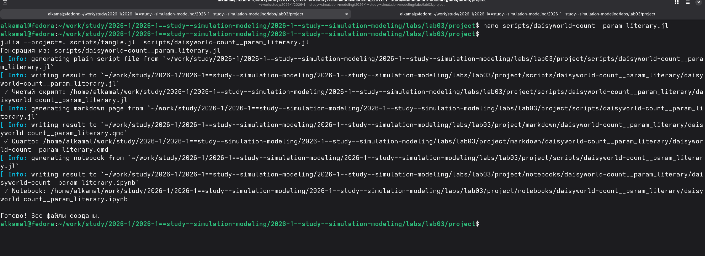
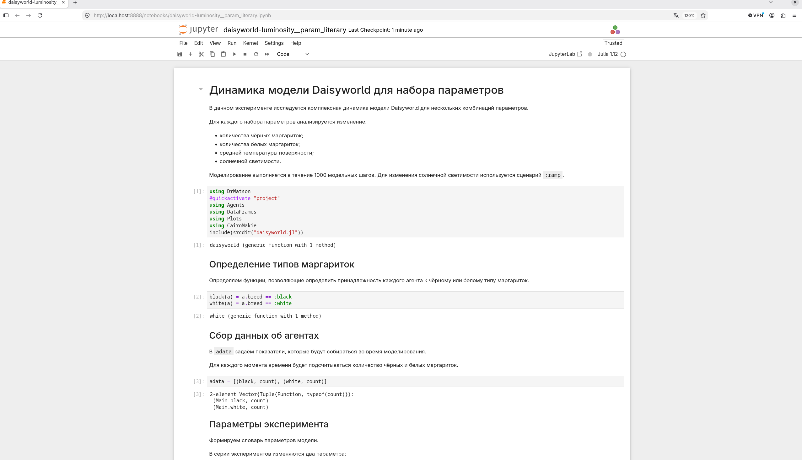

---
## Author
author:
  name: Ибрахим Мохсейн Алькамаль
  degrees: Student (3 курс)
  orcid: ""
  email: 1032225432@rudn.ru
  affiliation:
    - name: Российский университет дружбы народов
      country: Российская Федерация
      postal-code: 117198
      city: Москва
      address: ул. Миклухо-Маклая, д. 6

## Title
title: "Отчёт по лабораторной работе №3"
subtitle: "Имитационное моделирование"
license: "CC BY"
---

# Цель работы

Изучить принципы агентного моделирования на примере модели Daisyworld, реализовать модель взаимодействия чёрных и белых маргариток с окружающей средой и исследовать её динамику. Провести вычислительные эксперименты при различных параметрах модели, проанализировать изменение численности агентов, температуры поверхности и солнечной светимости.

# Выполнение лабораторной работы

## Подготовка рабочего проекта

Для выполнения лабораторной работы был подготовлен отдельный проект `lab03/project`. С помощью скрипта `setup_project.jl` выполнена инициализация структуры проекта и установка необходимых зависимостей ([рис. @fig-1]).

{#fig-1 width=70%}

После завершения установки проектное окружение было активировано командой `julia --project=.`. Команда `Pkg.status()` использована для проверки установленных пакетов, включая `Agents`, `CairoMakie`, `DrWatson`, `DataFrames` и другие библиотеки ([рис. @fig-2]).

{#fig-2 width=70%}

## Реализация модели Daisyworld

В каталоге проекта созданы файл `src/daisyworld.jl` с реализацией агентной модели Daisyworld и скрипт `scripts/daisyworld.jl` для её базовой визуализации ([рис. @fig-3]).

{#fig-3 width=70%}

Скрипт `scripts/daisyworld.jl` выполнен в активном окружении проекта. В результате в каталоге `plots` сформированы изображения модели для начального состояния, после 5 и после 40 шагов моделирования ([рис. @fig-4]).

{#fig-4 width=70%}

## Преобразование кода в литературный стиль

Для документирования базовой визуализации подготовлен файл `scripts/daisyworld_literary.jl`. С помощью `tangle.jl` из литературного кода автоматически сгенерированы чистый Julia-скрипт, документ Quarto и Jupyter Notebook ([рис. @fig-5]).

{#fig-5 width=70%}

## Выполнение Jupyter Notebook

Сгенерированный `daisyworld_literary.ipynb` выполнен в Jupyter. В ноутбуке проведена инициализация модели Daisyworld, настроено отображение агентов и заданы параметры визуализации температурной карты поверхности ([рис. @fig-6]).

{#fig-6 width=70%}

## Создание анимации модели Daisyworld

Для визуализации динамики модели подготовлен скрипт `scripts/daisyworld-animate.jl`. В нём задаются параметры отображения агентов и температурного поля, а функция `abmvideo` используется для формирования анимации из 60 кадров ([рис. @fig-7]).

{#fig-7 width=70%}

Скрипт анимации выполнен командой `julia --project=. scripts/daisyworld-animate.jl` в активном окружении проекта ([рис. @fig-8]).

{#fig-8 width=70%}

Полученная анимация отображает изменение состояния Daisyworld во времени. На кадрах представлены агенты модели и температурное поле поверхности с диапазоном значений от −20 до 60 ([рис. @fig-9]).

{#fig-9 width=70%}

## Подсчёт количества агентов

Для анализа количества чёрных и белых маргариток подготовлены скрипты `daisyworld-count.jl` и `daisyworld-count_literary.jl`. После выполнения литературной версии с помощью `tangle.jl` автоматически сформированы чистый Julia-скрипт, документ Quarto и Jupyter Notebook ([рис. @fig-10]).

{#fig-10 width=70%}

## Выполнение моделирования и сбор данных

В Jupyter Notebook сформирован набор данных для подсчёта чёрных и белых маргариток. Модель инициализирована с начальной солнечной светимостью `1.0` и выполнена на 1000 модельных шагов. Полученные значения количества агентов сохранены в таблице `agent_df` ([рис. @fig-11]).

{#fig-11 width=70%}

## Исследование изменения солнечной светимости

Для исследования поведения Daisyworld при изменении солнечной светимости подготовлен литературный скрипт `daisyworld-luminosity_literary.jl`. С помощью `tangle.jl` из него автоматически сформированы чистый Julia-скрипт, документ Quarto и Jupyter Notebook ([рис. @fig-12]).

{#fig-12 width=70%}

В Jupyter Notebook построены три связанных графика: изменение количества чёрных и белых маргариток, температуры и солнечной светимости в течение моделирования. Графики позволяют сопоставить динамику агентов и температуры с изменением параметра `solar_luminosity` ([рис. @fig-13]).

{#fig-13 width=70%}

## Исследование влияния параметров модели

Для проведения серии экспериментов подготовлен скрипт `daisyworld__param.jl`. После его выполнения в каталоге `plots/` сформированы изображения для различных комбинаций параметров модели и отдельных шагов моделирования ([рис. @fig-14]).

{#fig-14 width=70%}

Для документирования экспериментов создан литературный скрипт `daisyworld__param_literary.jl`. С помощью `tangle.jl` из него сформированы чистый Julia-скрипт, документ Quarto и Jupyter Notebook ([рис. @fig-15]).

{#fig-15 width=70%}

В Jupyter Notebook выполняется последовательный перебор наборов параметров. Для каждого набора создаётся отдельная модель Daisyworld, после чего состояние системы сохраняется на шагах 1, 5 и 40. В эксперименте рассматриваются различные комбинации параметров `max_age` и `init_white` ([рис. @fig-16]).

{#fig-16 width=70%}

Скрипт `daisyworld-luminosity.jl` выполнен в активном окружении проекта. Полученный график `daisy_luminosity.png` сохранён вместе с другими результатами моделирования в каталоге `plots/` ([рис. @fig-17]).

{#fig-17 width=70%}

## Исследование динамики Daisyworld при различных параметрах

В Jupyter Notebook исследуется динамика модели Daisyworld для нескольких комбинаций параметров. Для каждого эксперимента анализируются количество чёрных и белых маргариток, средняя температура поверхности и солнечная светимость; моделирование выполняется в течение 1000 шагов со сценарием `:ramp` ([рис. @fig-18]).

{#fig-18 width=70%}

Для анализа численности маргариток при различных параметрах выполнен скрипт `daisyworld-count__param.jl`. В результате в каталоге `plots/` сформированы четыре графических файла для различных комбинаций `max_age` и `init_white` ([рис. @fig-19]).

{#fig-19 width=70%}

Для документирования эксперимента подготовлен литературный скрипт `daisyworld-count__param_literary.jl`. С помощью `tangle.jl` из него сформированы чистый Julia-скрипт, документ Quarto и Jupyter Notebook ([рис. @fig-20]).

{#fig-20 width=70%}

В сгенерированном Jupyter Notebook для каждого набора параметров создаётся отдельная модель и выполняется 1000 шагов моделирования. По собранным данным строятся графики изменения количества чёрных и белых маргариток; рассматриваются четыре комбинации параметров `max_age` и `init_white` ([рис. @fig-21]).

{#fig-21 width=70%}

Для исследования солнечной светимости при разных параметрах выполнен скрипт `daisyworld-luminosity__param.jl`. В каталоге `plots/` созданы четыре результата для различных комбинаций `max_age` и `init_white` со сценарием `ramp` ([рис. @fig-22]).

{#fig-22 width=70%}

Для документирования данного эксперимента подготовлен литературный скрипт `daisyworld-luminosity__param_literary.jl`. После выполнения `tangle.jl` успешно сформированы чистый Julia-скрипт, документ Quarto и соответствующий Jupyter Notebook ([рис. @fig-23]).

{#fig-23 width=70%}








# Выводы

В ходе лабораторной работы была реализована и исследована агентная модель Daisyworld. Выполнена визуализация состояния модели, построена анимация её динамики и проведён сбор данных о численности чёрных и белых маргариток. Исследовано изменение состояния системы при изменении солнечной светимости и различных значениях параметров max_age и init_white. Результаты моделирования представлены в виде графиков и Jupyter Notebook, что позволило наглядно проследить динамику модели при разных условиях.