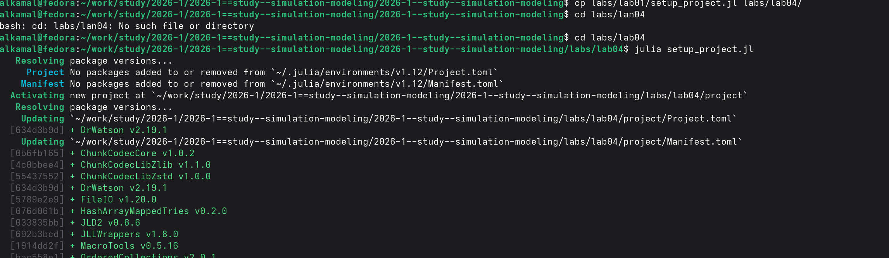
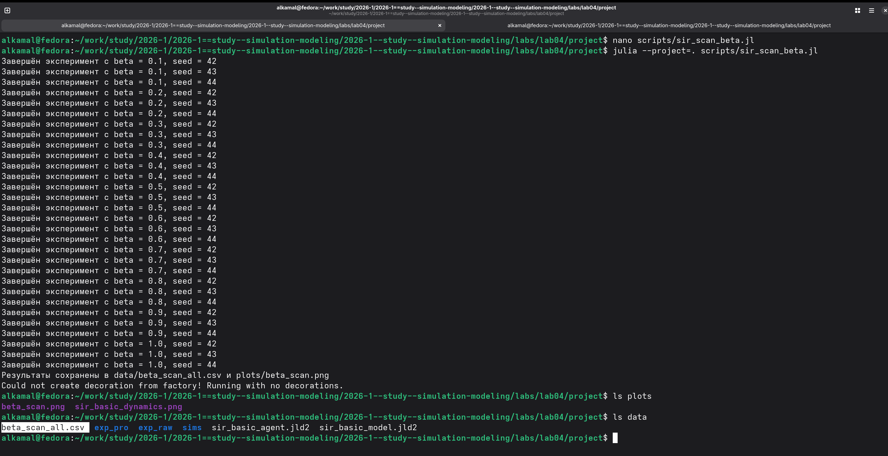
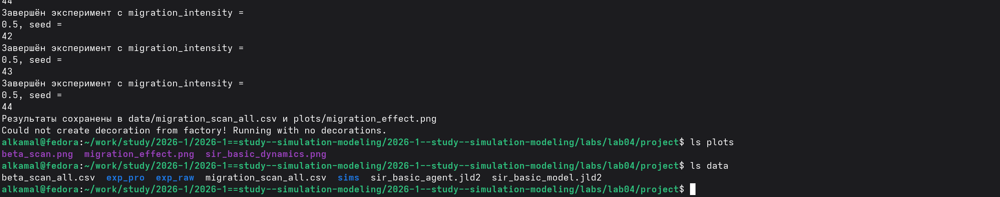
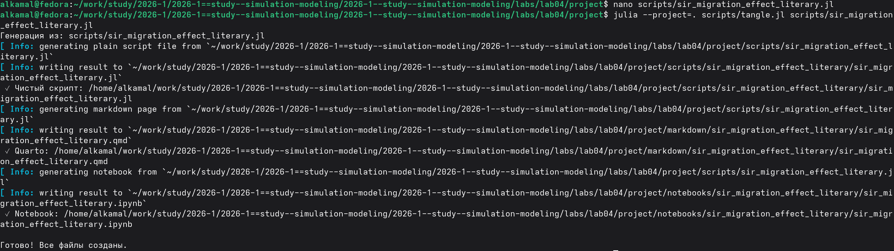
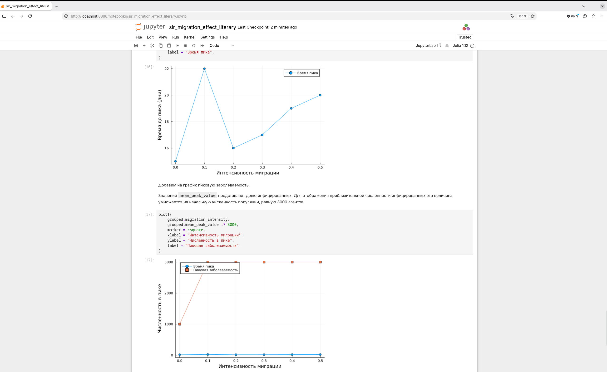
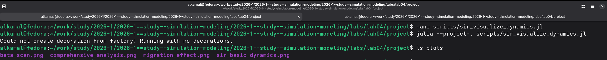

---
## Author
author:
  name: Ибрахим Мохсейн Алькамаль
  degrees: Student (3 курс)
  orcid: ""
  email: 1032225432@rudn.ru
  affiliation:
    - name: Российский университет дружбы народов
      country: Российская Федерация
      postal-code: 117198
      city: Москва
      address: ул. Миклухо-Маклая, д. 6
## Title
title: Лабораторная работа №4
subtitle: Имитационное моделирование
license: CC BY
date: today
date-format: "YYYY-MM-DD" # Example: 2025-09-06
---

# Информация

## Докладчик

:::::::::::::: {.columns align=center}
::: {.column width="70%"}

  - Ибрахим Мохсейн Алькамаль
  - Российский университет дружбы народов

:::
::: {.column width="30%"}

:::
::::::::::::::

# Цель работы

- Изучить реализацию эпидемиологической модели SIR в агентном подходе.
- Выполнить базовое моделирование.
- Исследовать влияние коэффициента заразности на распространение инфекции.

# Выполнение лабораторной работы

## Подготовка рабочего проекта

- Создан проект `lab04/project`.
- Выполнен скрипт `setup_project.jl`.
- Инициализировано проектное окружение.
- Установлены необходимые зависимости.

{#fig-1 width=70%}

## Проверка установленных пакетов

- Окружение активировано командой `julia --project=.`.
- Установленные пакеты проверены командой `Pkg.status()`.
- Проверено наличие `Agents`, `BlackBoxOptim`, `CSV`, `DataFrames`, `Distributions`, `DrWatson`, `JLD2` и `Plots`.

{#fig-2 width=70%}

## Базовый эксперимент модели SIR

- Выполнен скрипт `scripts/sir_run_basic.jl`.
- Сформирован график `sir_basic_dynamics.png`.
- Результаты сохранены в `sir_basic_agent.jld2` и `sir_basic_model.jld2`.

{#fig-3 width=70%}

## Преобразование базового эксперимента в литературный стиль

- Подготовлен файл `sir_run_basic_literary.jl`.
- Выполнено преобразование с помощью `tangle.jl`.
- Сформированы Julia-скрипт, документ Quarto и Jupyter Notebook.

{#fig-4 width=70%}

## Выполнение базового эксперимента в Jupyter Notebook

- Выполнен `sir_run_basic_literary.ipynb`.
- Построена динамика восприимчивых, инфицированных и выздоровевших.
- Представлена общая численность популяции.
- Период моделирования — 100 дней.

{#fig-5 width=70%}

## Сканирование коэффициента заразности

- Выполнен скрипт `sir_scan_beta.jl`.
- Исследованы значения `beta` от `0.1` до `1.0`.
- Использованы `seed`: `42`, `43` и `44`.
- Результаты сохранены в `beta_scan_all.csv`.
- График сохранён в `beta_scan.png`.

{#fig-6 width=70%}

## Преобразование сканирования коэффициента заразности в литературный стиль

- Подготовлен файл `sir_scan_beta_literary.jl`.
- Выполнен `tangle.jl`.
- Сформированы Julia-скрипт, документ Quarto и Jupyter Notebook.

{#fig-7 width=70%}

## Анализ коэффициента заразности в Jupyter Notebook

- Исследована зависимость показателей эпидемии от коэффициента `β`.
- Построена пиковая доля инфицированных.
- Построена конечная доля инфицированных.

{#fig-8 width=70%}

## Исследование влияния миграции

- Выполнен скрипт `sir_migration_effect.jl`.
- Исследованы различные значения `migration_intensity`.
- Использованы `seed` `42`, `43` и `44`.

{#fig-9 width=70%}

## Сохранение результатов исследования влияния

- Результаты сохранены в `data/migration_scan_all.csv`.
- График сохранён в `plots/migration_effect.png`.
- Проверено наличие созданных файлов.

{#fig-10 width=70%}

## Преобразование исследования миграции в литературный стиль

- Подготовлен файл `sir_migration_effect_literary.jl`.
- Выполнено преобразование с помощью `tangle.jl`.
- Сформированы Julia-скрипт, документ Quarto и Jupyter Notebook.

{#fig-11 width=70%}

## Анализ влияния миграции в Jupyter Notebook

- Выполнен `sir_migration_effect_literary.ipynb`.
- Исследована зависимость времени пика от интенсивности миграции.
- Исследована пиковая численность заболевших.

{#fig-12 width=70%}

## Оптимизация параметров модели

- Выполнена многокритериальная оптимизация.
- Использован скрипт `sir_optimize_parameters.jl`.
- Алгоритм оптимизации — `borg_moea`.
- Критерии: пиковая заболеваемость и доля умерших.
- Получено $\beta_{und} \approx 0.2661$.
- Время выявления инфекции — 4 дня.
- Смертность — около $0.0704$.
- Пиковая заболеваемость — около $0.00173$.
- Доля умерших — около $6.67 \cdot 10^{-5}$.
- Результат сохранён в `data/optimization_result.jld2`.

---

{#fig-13 width=70%}

## Преобразование оптимизации в литературный стиль

- Подготовлен файл `sir_optimize_parameters_literary.jl`.
- Выполнено преобразование с помощью `tangle.jl`.
- Сформированы Julia-скрипт, документ Quarto и Jupyter Notebook.

{#fig-14 width=70%}

## Выполнение оптимизации в Jupyter Notebook

- Выполнен `sir_optimize_parameters_literary.ipynb`.
- Использована схема `ParetoFitnessScheme(2)`.
- Одновременно минимизируются два критерия.
- Использован алгоритм `borg_moea`.
- Максимальное время оптимизации — 120 секунд.
- Получены параметры и значения целевых функций.

{#fig-15 width=70%}

## Комплексная визуализация результатов

- Выполнен скрипт `sir_visualize_dynamics.jl`.
- Сформирован график `comprehensive_analysis.png`.
- Результат сохранён в каталоге `plots`.

{#fig-16 width=70%}

## Преобразование визуализации в литературный стиль

- Подготовлен файл `sir_visualize_dynamics_literary.jl`.
- Выполнено преобразование с помощью `tangle.jl`.
- Сформированы Julia-скрипт, документ Quarto и Jupyter Notebook.

{#fig-17 width=70%}

## Анализ результатов в Jupyter Notebook

- Построен составной график показателей модели.
- Исследована зависимость от коэффициента `β`.
- Представлены пиковая и конечная доли инфицированных.
- Представлены число умерших и доля выздоровевших.

{#fig-18 width=70%}

# Выводы

- Реализована и исследована агентная модель SIR.
- Проведено базовое моделирование динамики агентов.
- Исследовано влияние коэффициента заразности `β`.
- Исследовано влияние интенсивности миграции.
- Выполнена многокритериальная оптимизация параметров.
- Проведена комплексная визуализация результатов.
- Результаты сохранены в виде графиков и файлов данных.
- Литературные версии представлены в Quarto и Jupyter Notebook.