---
## Author
author:
  name: Ибрахим Мохсейн Алькамаль
  degrees: Student (3 курс)
  orcid: ""
  email: 1032225432@rudn.ru
  affiliation:
    - name: Российский университет дружбы народов
      country: Российская Федерация
      postal-code: 117198
      city: Москва
      address: ул. Миклухо-Маклая, д. 6

## Title
title: "Отчёт по лабораторной работе №4"
subtitle: "Имитационное моделирование"
license: "CC BY"
---

# Цель работы

Изучить реализацию эпидемиологической модели SIR в агентном подходе. Выполнить базовое моделирование и исследовать влияние коэффициента заразности на динамику распространения инфекции.

# Выполнение лабораторной работы

## Подготовка рабочего проекта

Для выполнения лабораторной работы был создан проект `lab04/project`. С помощью скрипта `setup_project.jl` выполнена инициализация проектного окружения и установка необходимых зависимостей ([рис. @fig-1]).

{#fig-1 width=70%}

После подготовки проекта окружение было активировано командой `julia --project=.`. Команда `Pkg.status()` использована для проверки установленных пакетов, включая `Agents`, `BlackBoxOptim`, `CSV`, `DataFrames`, `Distributions`, `DrWatson`, `JLD2` и `Plots` ([рис. @fig-2]).

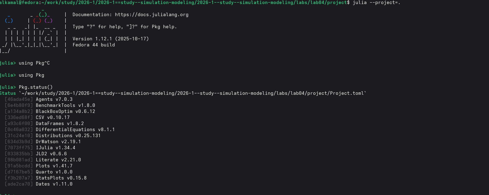{#fig-2 width=70%}

## Базовый эксперимент модели SIR

Базовый эксперимент выполнен с помощью скрипта `scripts/sir_run_basic.jl`. После моделирования сформирован график `sir_basic_dynamics.png`, а результаты сохранены в файлах `sir_basic_agent.jld2` и `sir_basic_model.jld2` ([рис. @fig-3]).

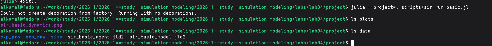{#fig-3 width=70%}

## Преобразование базового эксперимента в литературный стиль

Для документирования базового эксперимента подготовлен литературный скрипт `sir_run_basic_literary.jl`. С помощью `tangle.jl` из него автоматически сформированы чистый Julia-скрипт, документ Quarto и Jupyter Notebook ([рис. @fig-4]).

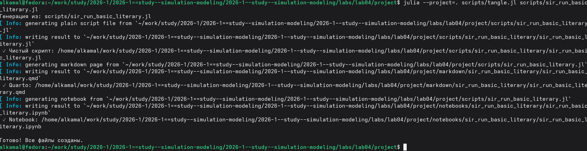{#fig-4 width=70%}

## Выполнение базового эксперимента в Jupyter Notebook

Сгенерированный `sir_run_basic_literary.ipynb` выполнен в Jupyter Notebook. Получен график динамики восприимчивых, инфицированных и выздоровевших агентов, а также общей численности популяции в течение 100 дней ([рис. @fig-5]).

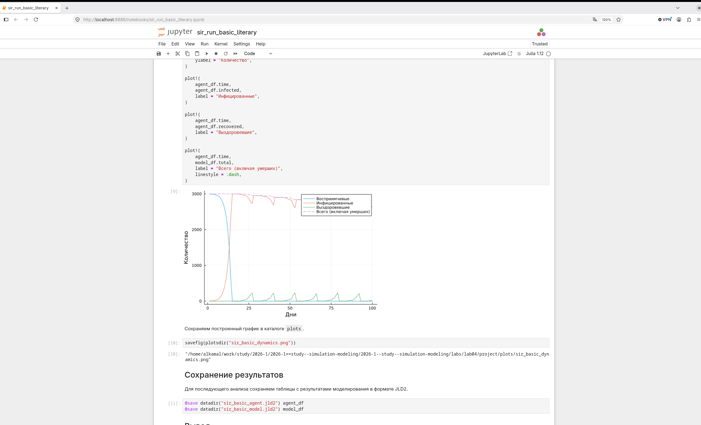{#fig-5 width=70%}

## Сканирование коэффициента заразности

Для исследования влияния коэффициента заразности выполнен скрипт `sir_scan_beta.jl`. Проведены эксперименты для значений `beta` от `0.1` до `1.0` с тремя значениями `seed`: `42`, `43` и `44`. Результаты сохранены в `beta_scan_all.csv`, а график — в `beta_scan.png` ([рис. @fig-6]).

{#fig-6 width=70%}

## Преобразование сканирования коэффициента заразности в литературный стиль

Для документирования параметрического эксперимента подготовлен файл `sir_scan_beta_literary.jl`. После выполнения `tangle.jl` успешно сформированы чистый Julia-скрипт, документ Quarto и Jupyter Notebook ([рис. @fig-7]).

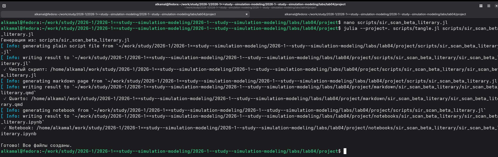{#fig-7 width=70%}

## Анализ коэффициента заразности в Jupyter Notebook

В Jupyter Notebook построены графики зависимости эпидемических показателей от коэффициента заразности `β`. На графиках представлены пиковая и конечная доли инфицированных для исследуемого диапазона значений `β` ([рис. @fig-8]).

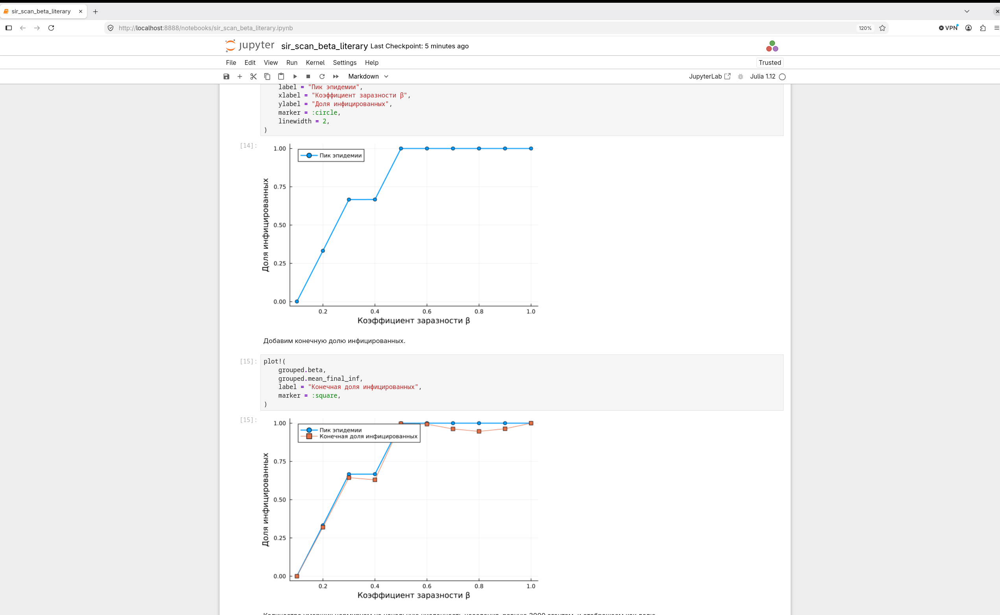{#fig-8 width=70%}

## Исследование влияния миграции

Для исследования влияния миграции выполнен скрипт `sir_migration_effect.jl`. Проведена серия экспериментов с различными значениями параметра `migration_intensity` и значениями `seed` 42, 43 и 44 ([рис. @fig-9]).

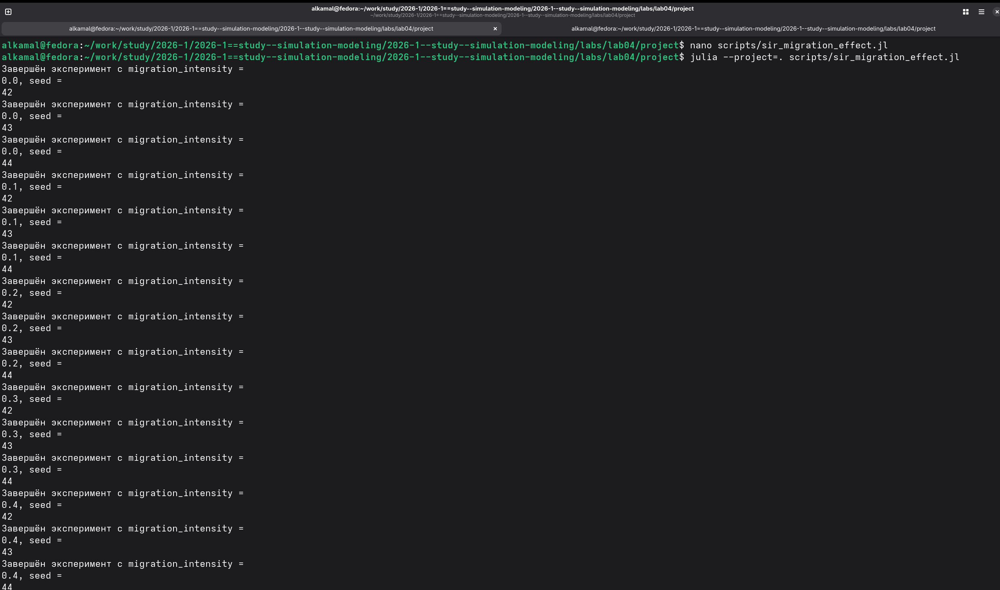{#fig-9 width=70%}

После завершения экспериментов результаты сохранены в файле `data/migration_scan_all.csv`, а график исследования — в файле `plots/migration_effect.png`. Наличие созданных файлов проверено в каталогах `data` и `plots` ([рис. @fig-10]).

{#fig-10 width=70%}

## Преобразование исследования миграции в литературный стиль

Для документирования эксперимента подготовлен файл `sir_migration_effect_literary.jl`. С помощью скрипта `tangle.jl` автоматически сформированы чистый Julia-скрипт, документ Quarto и Jupyter Notebook ([рис. @fig-11]).

{#fig-11 width=70%}

## Анализ влияния миграции в Jupyter Notebook

Сгенерированный `sir_migration_effect_literary.ipynb` выполнен в Jupyter Notebook. Построены графики зависимости времени достижения пика эпидемии и пиковой численности заболевших от интенсивности миграции ([рис. @fig-12]).

{#fig-12 width=70%}

## Оптимизация параметров модели

Для поиска параметров, позволяющих уменьшить основные показатели распространения инфекции, выполнена многокритериальная оптимизация с помощью скрипта `sir_optimize_parameters.jl`. В качестве алгоритма использован `borg_moea`, а критериями оптимизации являлись пиковая заболеваемость и доля умерших.

В результате работы алгоритма получен набор параметров, обеспечивающий малые значения обоих критериев. Найденное значение параметра передачи инфекции составило $\beta_{und} \approx 0.2661$, время выявления инфекции — 4 дня, а смертность — приблизительно $0.0704$. При этих параметрах пиковая заболеваемость составила около $0.00173$, а доля умерших — около $6.67 \cdot 10^{-5}$. Результат оптимизации сохранён в файле `data/optimization_result.jld2` ([рис. @fig-13]).

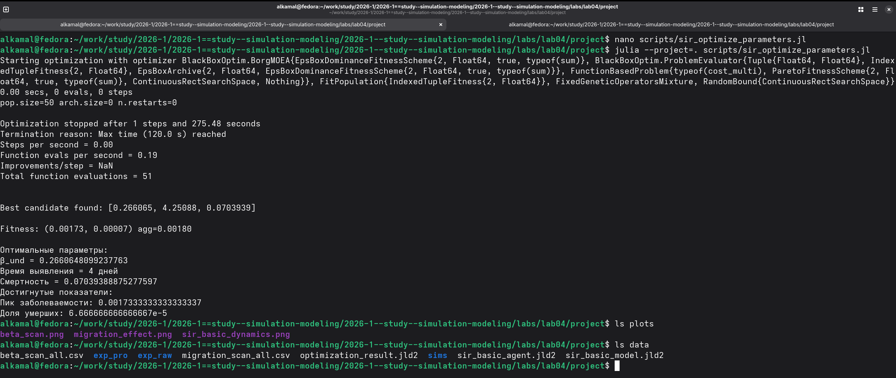{#fig-13 width=70%}

## Преобразование оптимизации в литературный стиль

Для документирования процедуры оптимизации подготовлен файл `sir_optimize_parameters_literary.jl`. С помощью скрипта `tangle.jl` выполнено автоматическое преобразование литературного исходного файла. В результате сформированы чистый Julia-скрипт, документ Quarto и Jupyter Notebook ([рис. @fig-14]).

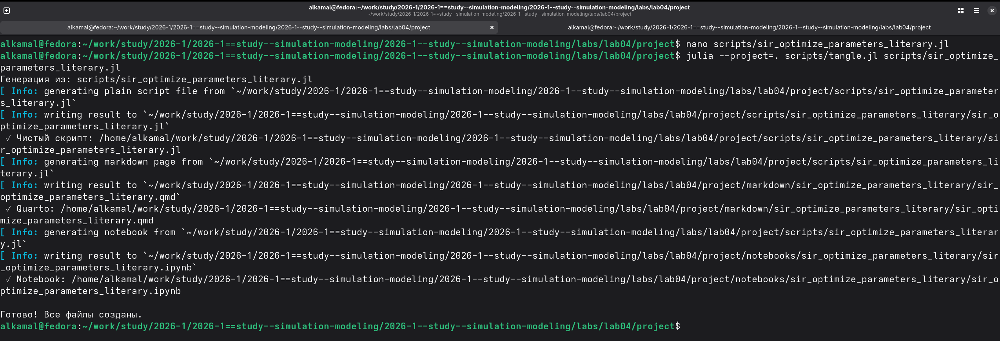{#fig-14 width=70%}

## Выполнение оптимизации в Jupyter Notebook

Сгенерированный файл `sir_optimize_parameters_literary.ipynb` выполнен в Jupyter Notebook. В ноутбуке задана схема `ParetoFitnessScheme(2)`, поскольку одновременно минимизируются два критерия. Для поиска используется алгоритм `borg_moea`, а максимальное время работы оптимизатора установлено равным 120 секундам.

После завершения вычислений из результата оптимизации извлекаются найденный набор параметров и соответствующие значения целевых функций ([рис. @fig-15]).

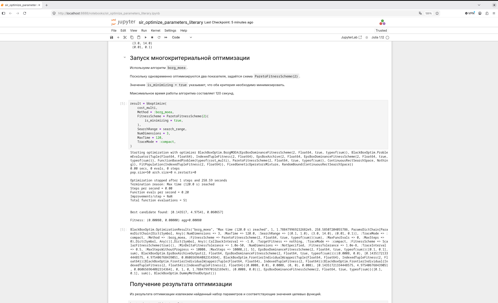{#fig-15 width=70%}

## Комплексная визуализация результатов

Для объединённого анализа результатов выполнен скрипт `sir_visualize_dynamics.jl`. После запуска сформирован график `comprehensive_analysis.png` в каталоге `plots` ([рис. @fig-16]).

{#fig-16 width=70%}

## Преобразование визуализации в литературный стиль

Для документирования визуализации подготовлен файл `sir_visualize_dynamics_literary.jl`. С помощью `tangle.jl` автоматически сформированы чистый Julia-скрипт, документ Quarto и Jupyter Notebook ([рис. @fig-17]).

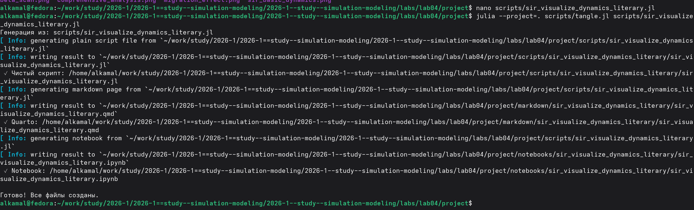{#fig-17 width=70%}

## Анализ результатов в Jupyter Notebook

В Jupyter Notebook построен составной график зависимости основных показателей модели от коэффициента `β`. На нём представлены пиковая и конечная доли инфицированных, число умерших и доля выздоровевших ([рис. @fig-18]).

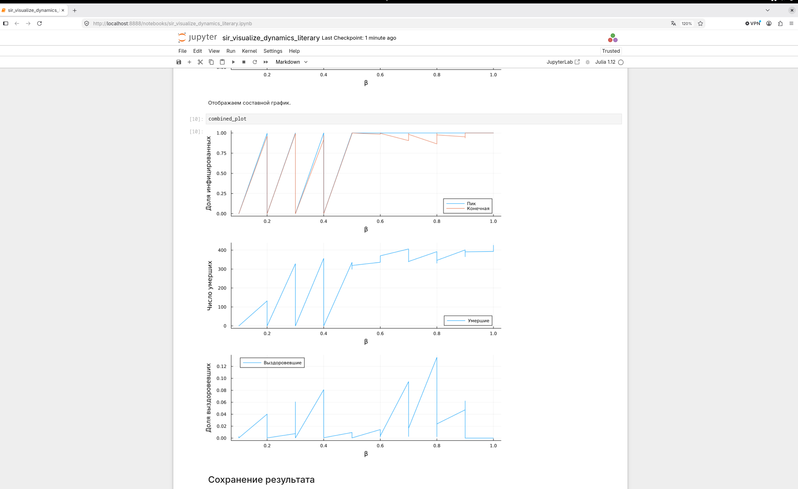{#fig-18 width=70%}







# Выводы

В ходе лабораторной работы была реализована и исследована агентная модель распространения эпидемии SIR. Проведено базовое моделирование динамики восприимчивых, инфицированных и выздоровевших агентов. Исследовано влияние коэффициента заразности `β` и интенсивности миграции на показатели эпидемии. Выполнена многокритериальная оптимизация параметров модели и проведена визуализация полученных результатов. Результаты экспериментов сохранены в виде графиков и файлов данных, а литературные версии программ представлены в формате Quarto и Jupyter Notebook.
