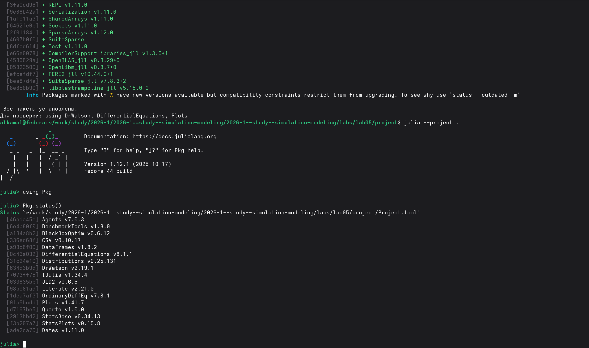
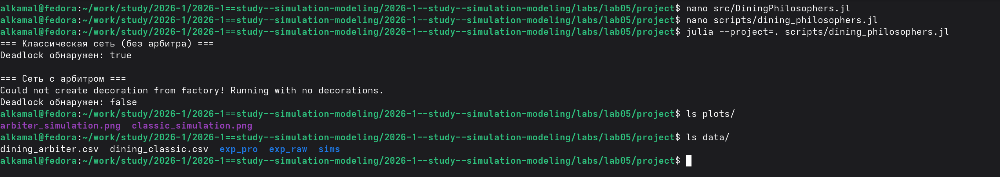
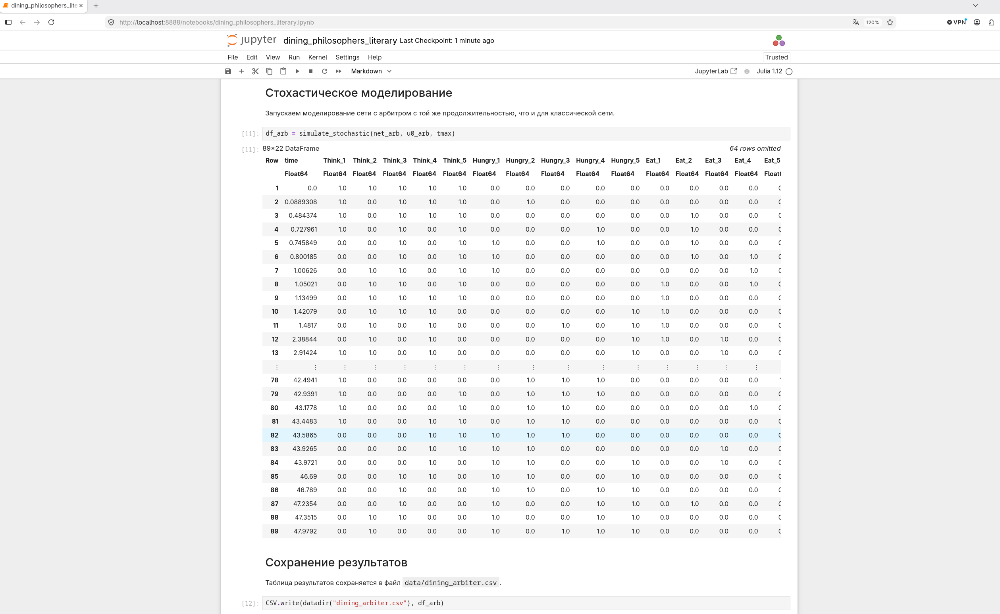
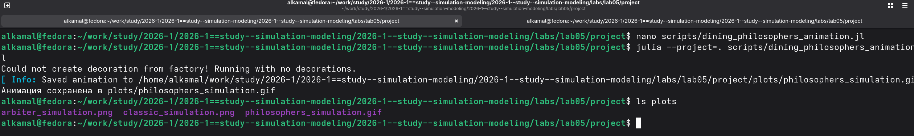
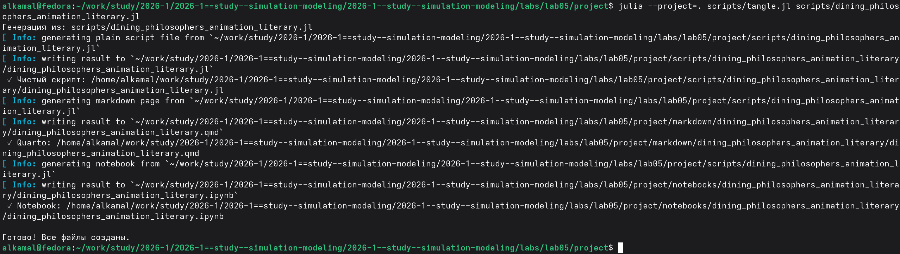
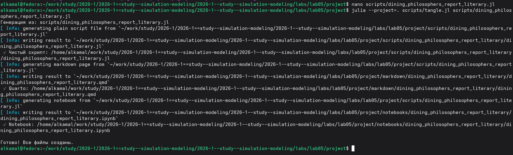

---
## Author
author:
  name: Ибрахим Мохсейн Алькамаль
  degrees: Student (3 курс)
  orcid: ""
  email: 1032225432@rudn.ru
  affiliation:
    - name: Российский университет дружбы народов
      country: Российская Федерация
      postal-code: 117198
      city: Москва
      address: ул. Миклухо-Маклая, д. 6
## Title
title: Лабораторная работа №5
subtitle: Имитационное моделирование
license: CC BY
date: today
date-format: "YYYY-MM-DD" # Example: 2025-09-06
---

# Информация

## Докладчик

:::::::::::::: {.columns align=center}
::: {.column width="70%"}

  - Ибрахим Мохсейн Алькамаль
  - Российский университет дружбы народов

:::
::: {.column width="30%"}

:::
::::::::::::::

# Цель работы

- Изучить аппарат сетей Петри на примере задачи «Обедающие философы».
- Реализовать классическую сеть и сеть с арбитром.
- Выполнить моделирование и исследовать взаимную блокировку.
- Визуализировать результаты моделирования.

# Выполнение лабораторной работы

## Подготовка рабочего проекта

- Создан проект `lab05/project`.
- Использован скрипт `setup_project.jl`.
- Установлены необходимые зависимости Julia.

{#fig-1 width=70%}

## Проверка проектного окружения

- Проект запущен командой `julia --project=.`.
- Наличие установленных пакетов проверено с помощью `Pkg.status()`.

{#fig-2 width=70%}

## Базовый эксперимент модели «Обедающие философы»

- Подготовлены `DiningPhilosophers.jl` и `dining_philosophers.jl`.
- Выполнено стохастическое моделирование двух сетей.
- Классическая сеть: Deadlock обнаружен: true.
- Сеть с арбитром: Deadlock обнаружен: false.
- Результаты сохранены в CSV-файлах и графиках.

---

{#fig-3 width=70%}

## Преобразование базового эксперимента в литературный стиль

- Подготовлен файл `dining_philosophers_literary.jl`.
- Выполнено преобразование с помощью `tangle.jl`.
- Сформированы Julia-скрипт, документ Quarto и Jupyter Notebook.

{#fig-4 width=70%}

## Выполнение базового эксперимента в Jupyter Notebook

- Выполнен `dining_philosophers_literary.ipynb`.
- Проведено стохастическое моделирование сети с арбитром.
- Получены состояния 'Think', 'Hungry' и 'Eat' для пяти философов.
- Результаты сохраняются в `data/dining_arbiter.csv`.

---

{#fig-5 width=70%}

## Создание анимации модели «Обедающие философы»

- Выполнен скрипт `dining_philosophers_animation.jl`.
- Создана GIF-анимация модели.
- Файл `philosophers_simulation.gif` сохранён в каталоге `plots`.

{#fig-6 width=70%}

## Преобразование скрипта анимации в литературный стиль

- Подготовлен файл `dining_philosophers_animation_literary.jl`.
- Выполнено преобразование с помощью `tangle.jl`.
- Сформированы Julia-скрипт, документ Quarto и Jupyter Notebook.

{#fig-7 width=70%}

## Выполнение анимации в Jupyter Notebook

- Выполнен `dining_philosophers_animation_literary.ipynb`.
- Анимация сохранена в формате GIF.
- Частота воспроизведения — два кадра в секунду.
- Кадры отображают изменение маркировки сети Петри во времени.

{#fig-8 width=70%}

## Формирование итогового графического отчёта

- Выполнен скрипт `dining_philosophers_report.jl`.
- Проведено сравнение классической сети и сети с арбитром.
- Создан график `final_report.png`.
- Результат сохранён в каталоге `plots`.

{#fig-9 width=70%}

## Преобразование итогового отчёта в литературный стиль

- Подготовлен файл `dining_philosophers_report_literary.jl`.
- Выполнено преобразование с помощью `tangle.jl`.
- Сформированы Julia-скрипт, документ Quarto и Jupyter Notebook.

{#fig-10 width=70%}

## Сравнение классической сети и сети с арбитром

- Выполнен `dining_philosophers_report_literary.ipynb`.
- Графики двух вариантов сети объединены в одну композицию.
- Отображено изменение состояний философов во времени.

{#fig-11 width=70%}

# Выводы

- Реализована модель «Обедающие философы» с использованием сетей Петри.
- Выполнено моделирование классической сети и сети с арбитром.
- В классической сети обнаружена взаимная блокировка.
- Использование арбитра позволило избежать взаимной блокировки.
- Результаты сохранены в виде таблиц, графиков и GIF-анимации.
- Выполнено сравнение двух вариантов сети.
- Подготовлены литературные версии программ в форматах Quarto и Jupyter Notebook.