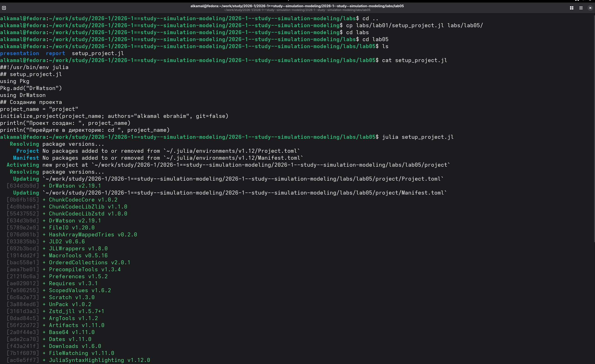
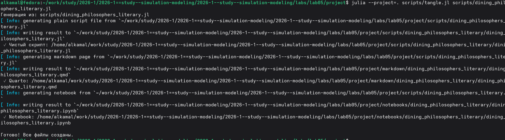
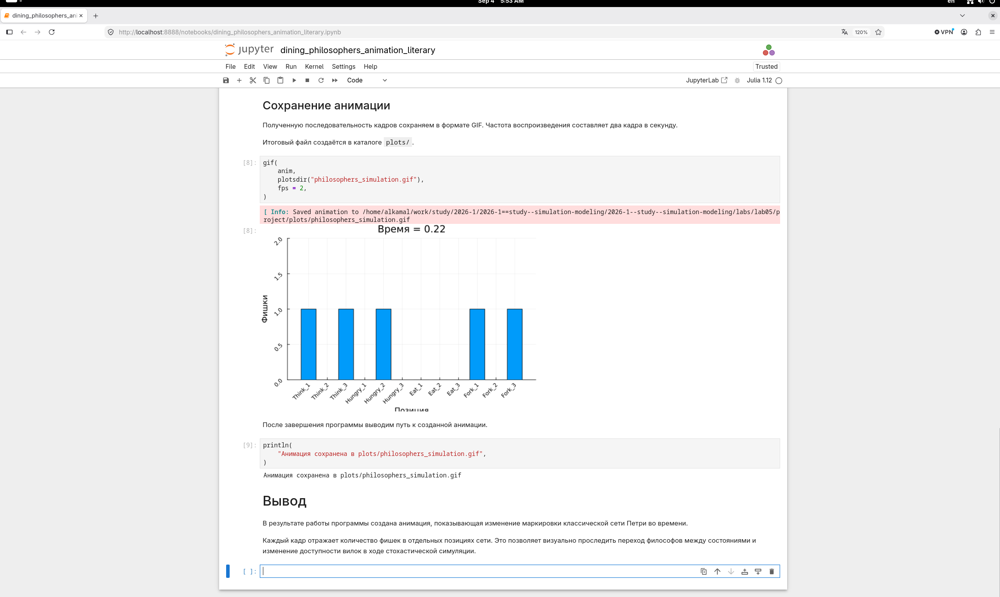
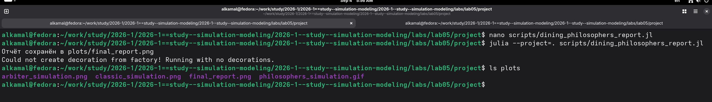
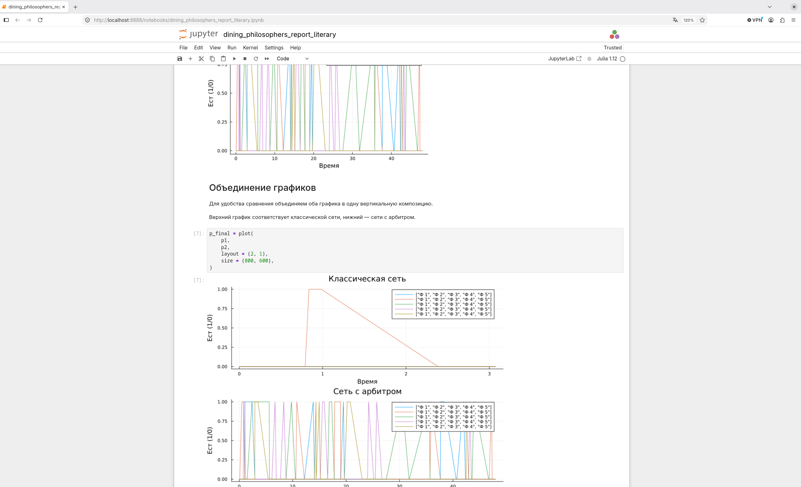

---
## Author
author:
  name: Ибрахим Мохсейн Алькамаль
  degrees: Student (3 курс)
  orcid: ""
  email: 1032225432@rudn.ru
  affiliation:
    - name: Российский университет дружбы народов
      country: Российская Федерация
      postal-code: 117198
      city: Москва
      address: ул. Миклухо-Маклая, д. 6

## Title
title: "Отчёт по лабораторной работе №5"
subtitle: "Имитационное моделирование"
license: "CC BY"
---

# Цель работы

Изучить аппарат сетей Петри на примере задачи «Обедающие философы». Реализовать классическую сеть и сеть с арбитром, выполнить их моделирование, исследовать возникновение взаимной блокировки и визуализировать результаты.

# Выполнение лабораторной работы

## Подготовка рабочего проекта

Для выполнения лабораторной работы был создан проект `lab05/project` с помощью скрипта `setup_project.jl`. После инициализации проектного окружения были установлены необходимые зависимости Julia ([рис. @fig-1]).

{#fig-1 width=70%}

## Проверка проектного окружения

Проектное окружение было запущено командой `julia --project=.`. С помощью `Pkg.status()` проверено наличие установленных пакетов, необходимых для выполнения моделирования и обработки результатов ([рис. @fig-2]).

{#fig-2 width=70%}

## Базовый эксперимент модели «Обедающие философы»

После подготовки модуля `DiningPhilosophers.jl` и скрипта `dining_philosophers.jl` выполнено стохастическое моделирование классической сети и сети с арбитром. Для классической сети обнаружено состояние взаимной блокировки (`Deadlock обнаружен: true`), а для сети с арбитром взаимная блокировка отсутствует (`Deadlock обнаружен: false`). Результаты сохранены в CSV-файлах и графиках ([рис. @fig-3]).

{#fig-3 width=70%}

## Преобразование базового эксперимента в литературный стиль

Для документирования эксперимента подготовлен литературный скрипт `dining_philosophers_literary.jl`. С помощью `tangle.jl` из него автоматически сформированы чистый Julia-скрипт, документ Quarto и Jupyter Notebook ([рис. @fig-4]).

{#fig-4 width=70%}

## Выполнение базового эксперимента в Jupyter Notebook

Сгенерированный `dining_philosophers_literary.ipynb` выполнен в Jupyter Notebook. В ноутбуке проведено стохастическое моделирование сети с арбитром и получена таблица изменения состояний `Think`, `Hungry` и `Eat` для пяти философов во времени. Результаты сохраняются в файл `data/dining_arbiter.csv` ([рис. @fig-5]).

{#fig-5 width=70%}

## Создание анимации модели «Обедающие философы»

Для визуализации изменения состояний сети Петри выполнен скрипт `dining_philosophers_animation.jl`. В результате создана GIF-анимация `philosophers_simulation.gif` и сохранена в каталоге `plots` ([рис. @fig-6]).

{#fig-6 width=70%}

## Преобразование скрипта анимации в литературный стиль

Для документирования процесса визуализации подготовлен файл `dining_philosophers_animation_literary.jl`. С помощью `tangle.jl` автоматически сформированы чистый Julia-скрипт, документ Quarto и Jupyter Notebook ([рис. @fig-7]).

{#fig-7 width=70%}

## Выполнение анимации в Jupyter Notebook

Сгенерированный `dining_philosophers_animation_literary.ipynb` выполнен в Jupyter Notebook. Последовательность кадров сохранена в формате GIF с частотой два кадра в секунду в файле `plots/philosophers_simulation.gif`. Кадры отображают изменение маркировки позиций сети Петри во времени ([рис. @fig-8]).

{#fig-8 width=70%}

## Формирование итогового графического отчёта

Для сравнения результатов классической сети и сети с арбитром выполнен скрипт `dining_philosophers_report.jl`. В результате сформирован итоговый график `final_report.png`, сохранённый в каталоге `plots` ([рис. @fig-9]).

{#fig-9 width=70%}

## Преобразование итогового отчёта в литературный стиль

Для документирования итогового анализа подготовлен файл `dining_philosophers_report_literary.jl`. С помощью `tangle.jl` автоматически сформированы чистый Julia-скрипт, документ Quarto и Jupyter Notebook ([рис. @fig-10]).

{#fig-10 width=70%}

## Сравнение классической сети и сети с арбитром

Сгенерированный `dining_philosophers_report_literary.ipynb` выполнен в Jupyter Notebook. Для сравнения объединены графики классической сети и сети с арбитром в одну вертикальную композицию, отображающую состояния философов во времени ([рис. @fig-11]).

{#fig-11 width=70%}





# Выводы

В ходе лабораторной работы была реализована модель «Обедающие философы» с использованием сетей Петри. Выполнено моделирование классической сети и сети с арбитром. В классической сети была обнаружена взаимная блокировка, тогда как использование арбитра позволило избежать её. Результаты моделирования сохранены в виде таблиц, графиков и GIF-анимации. Также выполнено сравнение поведения двух вариантов сети и подготовлены литературные версии программ в форматах Quarto и Jupyter Notebook.