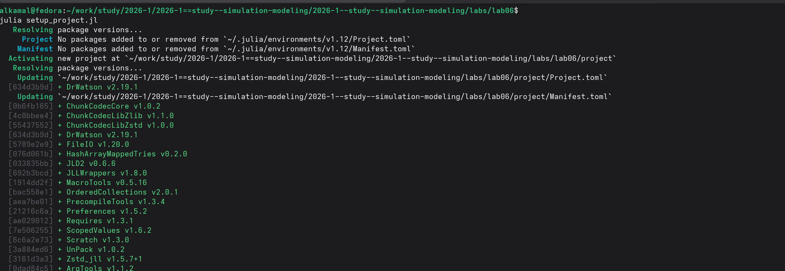
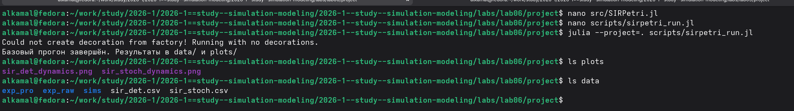
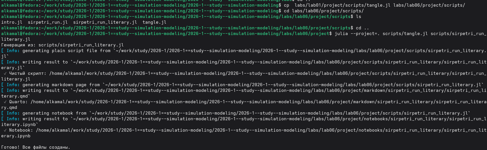
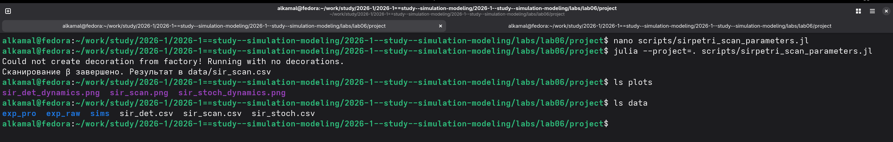
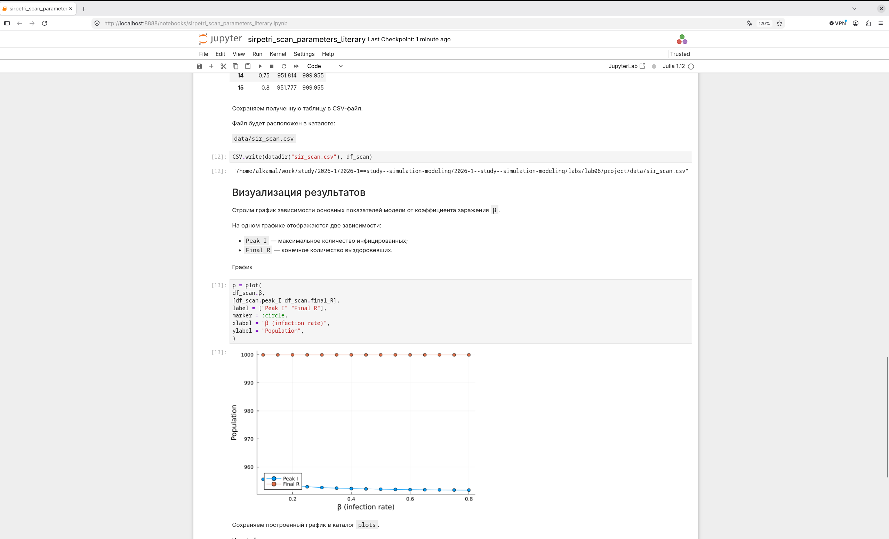
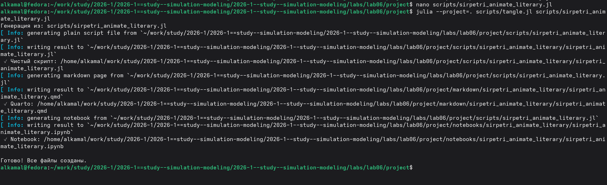
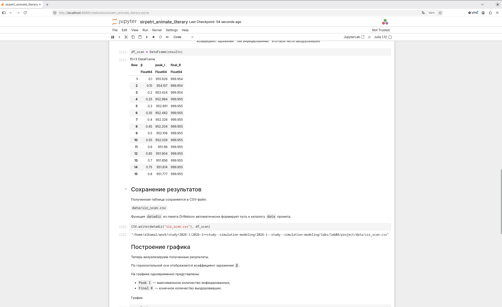
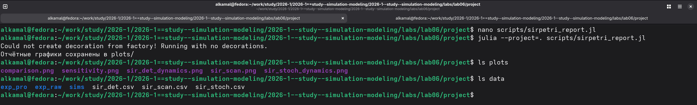
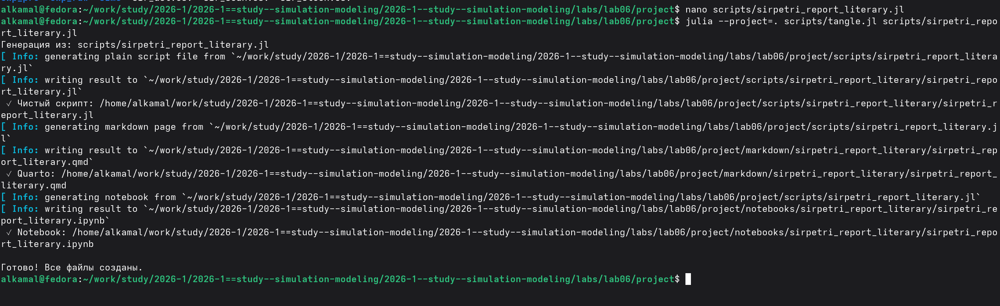

---
## Author
author:
  name: Ибрахим Мохсейн Алькамаль
  degrees: Student (3 курс)
  orcid: ""
  email: 1032225432@rudn.ru
  affiliation:
    - name: Российский университет дружбы народов
      country: Российская Федерация
      postal-code: 117198
      city: Москва
      address: ул. Миклухо-Маклая, д. 6
## Title
title: Лабораторная работа №6
subtitle: Имитационное моделирование
license: CC BY
date: today
date-format: "YYYY-MM-DD" # Example: 2025-09-06
---

# Информация

## Докладчик

:::::::::::::: {.columns align=center}
::: {.column width="70%"}

  - Ибрахим Мохсейн Алькамаль
  - Российский университет дружбы народов

:::
::: {.column width="30%"}

:::
::::::::::::::

# Цель работы

- Изучить реализацию эпидемиологической модели SIR с использованием сетей Петри.
- Выполнить детерминированное и стохастическое моделирование.
- Исследовать влияние коэффициента заражения $\beta$.
- Сравнить полученные динамики модели.

# Выполнение лабораторной работы

## Подготовка рабочего проекта

- Создан и активирован проект `lab06/project`.
- Использован скрипт `setup_project.jl`.
- Сформировано проектное окружение Julia.
- Установлены необходимые зависимости.

{#fig-1 width=70%}

## Проверка проектного окружения

- Проект запущен командой `julia --project=.`.
- Состав окружения проверен с помощью `Pkg.status()`.
- Проверено наличие необходимых пакетов.

{#fig-2 width=70%}

## Базовый прогон модели SIR

- Созданы модуль `SIRPetri.jl` и скрипт `sirpetri_run.jl`.
- Выполнен базовый прогон модели SIR.
- Результаты сохранены в `sir_det.csv` и `sir_stoch.csv`.
- Созданы графики `sir_det_dynamics.png` и `sir_stoch_dynamics.png`.

{#fig-3 width=70%}

## Преобразование базового эксперимента в литературный стиль

- Подготовлен файл `sirpetri_run_literary.jl`.
- Выполнен скрипт `tangle.jl`.
- Сформированы Julia-скрипт, документ Quarto и Jupyter Notebook.

{#fig-4 width=70%}

## Выполнение базового эксперимента в Jupyter Notebook

- Выполнен `sirpetri_run_literary.ipynb`.
- Получена детерминированная динамика состояний `S`, `I` и `R`.
- Получена стохастическая динамика состояний `S`, `I` и `R`.
- Отображено изменение численности групп во времени.

{#fig-5 width=70%}

## Сканирование параметра заражения

- Выполнен скрипт `sirpetri_scan_parameters.jl`.
- Исследовано влияние коэффициента заражения $\beta$.
- Результаты сохранены в `data/sir_scan.csv`.
- График сохранён в `plots/sir_scan.png`.

{#fig-6 width=70%}

## Преобразование сканирования параметров в литературный стиль

- Подготовлен файл `sirpetri_scan_parameters_literary.jl`.
- Выполнено преобразование с помощью `tangle.jl`.
- Сформированы Julia-скрипт, документ Quarto и Jupyter Notebook.

{#fig-7 width=70%}

## Анализ результатов сканирования в Jupyter Notebook

- Выполнен `sirpetri_scan_parameters_literary.ipynb`.
- Исследована зависимость `Peak I` от коэффициента $\beta$.
- Исследована зависимость `Final R` от коэффициента $\beta$.
- Результаты сохранены в `data/sir_scan.csv`.

{#fig-8 width=70%}

## Создание анимации модели SIR

- Подготовлен и выполнен скрипт `sirpetri_animate.jl`.
- Проверены результаты моделирования.
- Проверено содержимое каталогов `data` и `plots`.

{#fig-9 width=70%}

## Преобразование скрипта визуализации в литературный стиль

- Подготовлен файл `sirpetri_animate_literary.jl`.
- Выполнено преобразование с помощью `tangle.jl`.
- Сформированы Julia-скрипт, документ Quarto и Jupyter Notebook.

{#fig-10 width=70%}

## Выполнение литературной версии в Jupyter Notebook

- Выполнен `sirpetri_animate_literary.ipynb`.
- Получены результаты для $\beta$ от `0.1` до `0.8`.
- Рассчитаны показатели `peak_I` и `final_R`.
- Результаты сохранены в `data/sir_scan.csv`.
- Данные подготовлены для построения графика.

{#fig-11 width=70%}

## Формирование итогового отчёта

- Подготовлен и выполнен скрипт `sirpetri_report.jl`.
- Создан график `comparison.png`.
- Создан график `sensitivity.png`.
- Проверены результаты в каталогах `plots` и `data`.

{#fig-12 width=70%}

## Преобразование итогового отчёта в литературный стиль

- Подготовлен файл `sirpetri_report_literary.jl`.
- Выполнено преобразование с помощью `tangle.jl`.
- Сформированы Julia-скрипт, документ Quarto и Jupyter Notebook.

{#fig-13 width=70%}

## Анализ результатов в Jupyter Notebook

- Выполнен `sirpetri_report_literary.ipynb`.
- Сравнена детерминированная и стохастическая динамика инфицированных.
- Построена зависимость `Peak I` от коэффициента заражения $\beta$.
- Проведён анализ чувствительности модели.

{#fig-14 width=70%}

# Выводы

- Реализована модель SIR на основе сетей Петри.
- Выполнено детерминированное и стохастическое моделирование.
- Исследовано влияние коэффициента заражения $\beta$.
- Выполнено сравнение детерминированных и стохастических результатов.
- Проведён анализ чувствительности модели.
- Результаты сохранены в CSV-файлах и графиках.
- Литературные версии представлены в форматах Quarto и Jupyter Notebook.