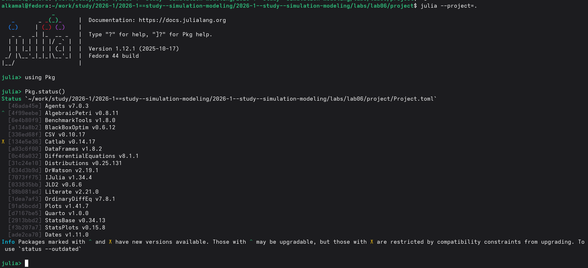
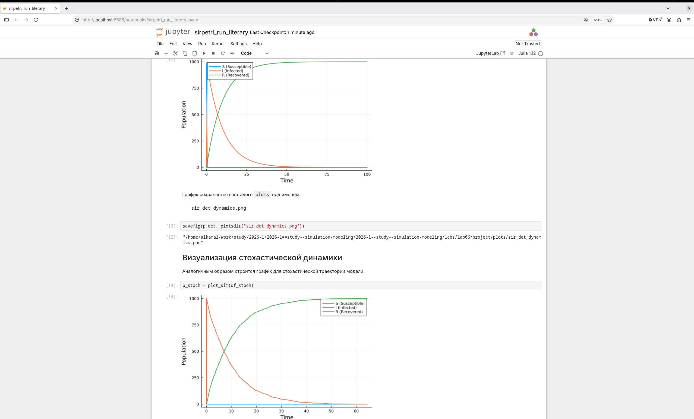
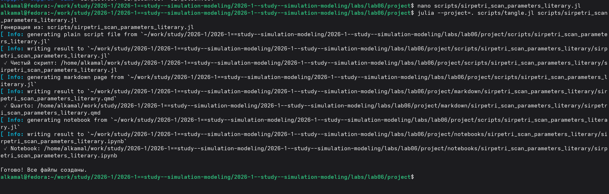
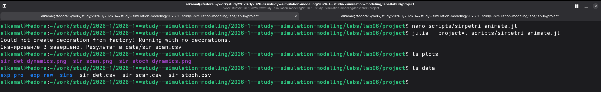
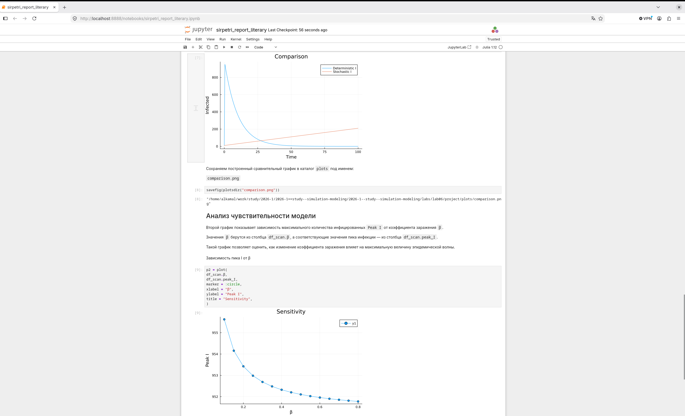

---
## Author
author:
  name: Ибрахим Мохсейн Алькамаль
  degrees: Student (3 курс)
  orcid: ""
  email: 1032225432@rudn.ru
  affiliation:
    - name: Российский университет дружбы народов
      country: Российская Федерация
      postal-code: 117198
      city: Москва
      address: ул. Миклухо-Маклая, д. 6

## Title
title: "Отчёт по лабораторной работе №6"
subtitle: "Имитационное моделирование"
license: "CC BY"
---

# Цель работы

Изучить реализацию эпидемиологической модели SIR с использованием аппарата сетей Петри. Выполнить детерминированное и стохастическое моделирование, исследовать влияние коэффициента заражения $\beta$ на результаты модели и провести сравнительный анализ полученных динамик.

# Выполнение лабораторной работы

## Подготовка рабочего проекта

Для выполнения лабораторной работы был создан и активирован проект `lab06/project` с помощью скрипта `setup_project.jl`. В процессе инициализации сформировано проектное окружение Julia и установлены необходимые зависимости ([рис. @fig-1]).

{#fig-1 width=70%}

## Проверка проектного окружения

Проект запущен командой `julia --project=.`. С помощью `Pkg.status()` проверен состав установленного окружения и наличие пакетов, необходимых для реализации и моделирования сети Петри ([рис. @fig-2]).

{#fig-2 width=70%}

## Базовый прогон модели SIR

После создания модуля `SIRPetri.jl` и скрипта `sirpetri_run.jl` выполнен базовый прогон модели SIR. Полученные результаты сохранены в CSV-файлах `sir_det.csv`, `sir_stoch.csv` и графиках `sir_det_dynamics.png`, `sir_stoch_dynamics.png` ([рис. @fig-3]).

{#fig-3 width=70%}

## Преобразование базового эксперимента в литературный стиль

Для документирования базового эксперимента подготовлен литературный скрипт `sirpetri_run_literary.jl`. С помощью `tangle.jl` из него автоматически сформированы чистый Julia-скрипт, документ Quarto и Jupyter Notebook ([рис. @fig-4]).

{#fig-4 width=70%}

## Выполнение базового эксперимента в Jupyter Notebook

Сгенерированный `sirpetri_run_literary.ipynb` выполнен в Jupyter Notebook. Получены графики детерминированной и стохастической динамики состояний `S`, `I` и `R`, отображающие изменение численности групп во времени ([рис. @fig-5]).

{#fig-5 width=70%}

## Сканирование параметра заражения

Для исследования влияния коэффициента заражения $\beta$ выполнен скрипт `sirpetri_scan_parameters.jl`. После завершения сканирования результаты сохранены в файле `data/sir_scan.csv`, а график — в `plots/sir_scan.png` ([рис. @fig-6]).

{#fig-6 width=70%}

## Преобразование сканирования параметров в литературный стиль

Для документирования параметрического исследования подготовлен файл `sirpetri_scan_parameters_literary.jl`. С помощью `tangle.jl` автоматически сформированы чистый Julia-скрипт, документ Quarto и Jupyter Notebook ([рис. @fig-7]).

{#fig-7 width=70%}

## Анализ результатов сканирования в Jupyter Notebook

Сгенерированный `sirpetri_scan_parameters_literary.ipynb` выполнен в Jupyter Notebook. Построен график зависимости максимального числа инфицированных `Peak I` и конечного числа выздоровевших `Final R` от коэффициента заражения $\beta$. Результаты сканирования также сохранены в `data/sir_scan.csv` ([рис. @fig-8]).

{#fig-8 width=70%}

## Создание анимации модели SIR

Для визуализации результатов подготовлен и выполнен скрипт `sirpetri_animate.jl`. После запуска проверено наличие ранее сформированных результатов моделирования в каталогах `data` и `plots` ([рис. @fig-9]).

{#fig-9 width=70%}

## Преобразование скрипта визуализации в литературный стиль

Для документирования визуализации подготовлен файл `sirpetri_animate_literary.jl`. С помощью `tangle.jl` автоматически сформированы чистый Julia-скрипт, документ Quarto и Jupyter Notebook ([рис. @fig-10]).

{#fig-10 width=70%}

## Выполнение литературной версии в Jupyter Notebook

Сгенерированный `sirpetri_animate_literary.ipynb` выполнен в Jupyter Notebook. В ноутбуке получена таблица результатов для значений коэффициента заражения $\beta$ от `0.1` до `0.8`, содержащая показатели `peak_I` и `final_R`. Результаты сохраняются в файл `data/sir_scan.csv` и используются для построения графика ([рис. @fig-11]).

{#fig-11 width=70%}

## Формирование итогового отчёта

Для формирования отчётных графиков подготовлен и выполнен скрипт `sirpetri_report.jl`. В результате в каталоге `plots` созданы файлы `comparison.png` и `sensitivity.png`. Также проверено наличие ранее полученных результатов моделирования в каталогах `plots` и `data` ([рис. @fig-12]).

{#fig-12 width=70%}

## Преобразование итогового отчёта в литературный стиль

Для документирования анализа подготовлен файл `sirpetri_report_literary.jl`. С помощью `tangle.jl` автоматически сформированы чистый Julia-скрипт, документ Quarto и Jupyter Notebook ([рис. @fig-13]).

{#fig-13 width=70%}

## Анализ результатов в Jupyter Notebook

Сгенерированный `sirpetri_report_literary.ipynb` выполнен в Jupyter Notebook. Построен график сравнения детерминированной и стохастической динамики инфицированных, а также график зависимости максимального числа инфицированных `Peak I` от коэффициента заражения $\beta$ ([рис. @fig-14]).

{#fig-14 width=70%}






# Выводы

В ходе лабораторной работы была реализована модель SIR на основе сетей Петри. Выполнено детерминированное и стохастическое моделирование динамики восприимчивых, инфицированных и выздоровевших. Проведено сканирование коэффициента заражения $\beta$ и исследовано его влияние на максимальное число инфицированных. Построены графики динамики модели, выполнено сравнение детерминированных и стохастических результатов и проведён анализ чувствительности. Результаты сохранены в виде CSV-файлов и графиков, а литературные версии программ представлены в форматах Quarto и Jupyter Notebook.

