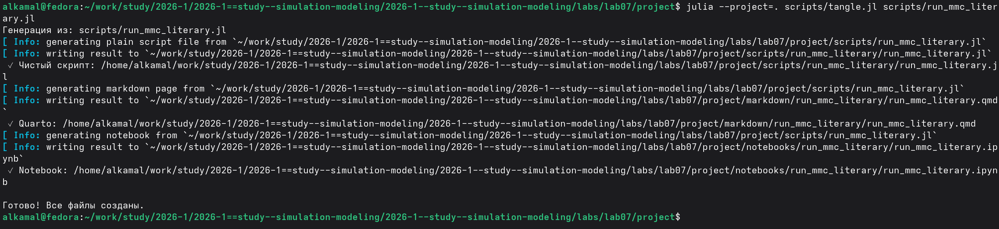

---
## Author
author:
  name: Ибрахим Мохсейн Алькамаль
  degrees: Student (3 курс)
  orcid: ""
  email: 1032225432@rudn.ru
  affiliation:
    - name: Российский университет дружбы народов
      country: Российская Федерация
      postal-code: 117198
      city: Москва
      address: ул. Миклухо-Маклая, д. 6
## Title
title: Лабораторная работа №7
subtitle: Имитационное моделирование
license: CC BY
date: today
date-format: "YYYY-MM-DD" # Example: 2025-09-06
---

# Информация

## Докладчик

:::::::::::::: {.columns align=center}
::: {.column width="70%"}

  - Ибрахим Мохсейн Алькамаль
  - Российский университет дружбы народов

:::
::: {.column width="30%"}

:::
::::::::::::::

# Цель работы

- Изучить принципы дискретно-событийного моделирования.
- Рассмотреть системы массового обслуживания.
- Реализовать и исследовать модели `M/M/c` и Росса.
- Рассчитать основные характеристики систем.
- Сравнить результаты симуляции с аналитическими значениями.

# Выполнение лабораторной работы

## Подготовка рабочего проекта

- Создан проект `lab07/project`.
- Использован скрипт `setup_project.jl`.
- Сформировано проектное окружение Julia.
- Установлена зависимость `DrWatson`.

{#fig-1 width=70%}

## Проверка проектного окружения

- Проект запущен командой `julia --project=.`.
- Состав окружения проверен с помощью `Pkg.status()`.
- Проверено наличие необходимых пакетов: `ConcurrentSim`, `Distributions`, `ResumableFunctions`, `StableRNGs`, `DataFrames` и `Plots`.

{#fig-2 width=70%}

## Выполнение модели M/M/c

- Запущен скрипт `run_mmc.jl`.
- Исследована модель `M/M/2`.
- Параметры: $\lambda=0.9$, $\mu=0.5$, $c=2$.
- Рассчитаны аналитические характеристики системы.
- График сохранён в `plots/mmc/mmc_analytics.png`.

{#fig-3 width=70%}

## Преобразование модели M/M/c в литературный стиль

- Подготовлен файл `run_mmc_literary.jl`.
- Выполнена обработка с помощью `tangle.jl`.
- Сформирован чистый Julia-скрипт.
- Созданы документ Quarto и Jupyter Notebook.

{#fig-4 width=70%}

## Выполнение модели M/M/c в Jupyter Notebook

- Открыт `run_mmc_literary.ipynb`.
- Выполнена литературная версия модели.
- Представлены функции расчёта аналитических характеристик.
- Реализовано построение соответствующих графиков.

{#fig-5 width=70%}

## Выполнение модели Росса

- Запущен скрипт `run_ross.jl`.
- Параметры: `N = 10`, `S = 3`, `R = 2`.
- Интенсивности: $\lambda = 1/100$, $\mu = 1/1.0$.
- Система определена как стационарная.
- Время до падения в одиночном прогоне — `78.36` часов.
- Запущены массовые прогоны для различных конфигураций.

{#fig-6 width=70%}

## Анализ результатов моделирования Росса

- Выполнена визуализация результатов массовых прогонов.
- Результаты симуляции сравнены с аналитическими значениями.
- Построены тепловые карты для `R = 1` и `R = 2`.
- Проведён анализ загрузки ремонтников.
- Графики сохранены в каталоге `plots/ross`.

{#fig-7 width=70%}

## Преобразование модели Росса в литературный стиль

- Подготовлен файл `run_ross_literary.jl`.
- Выполнена обработка с помощью `tangle.jl`.
- Сформирован чистый Julia-скрипт.
- Созданы документ Quarto и Jupyter Notebook.

{#fig-8 width=70%}

## Выполнение модели Росса в Jupyter Notebook

- Выполнен `run_ross_literary.ipynb`.
- Представлены функции анализа загрузки ремонтников.
- Представлена основная функция запуска модели.
- Выполняется работа с заданными параметрами.
- Реализована проверка стационарности системы.

---

{#fig-9 width=70%}

# Выводы

- Реализованы и исследованы дискретно-событийные модели `M/M/c` и Росса.
- Для `M/M/c` рассчитаны аналитические характеристики и построены графики.
- Для модели Росса выполнены одиночный и массовые прогоны.
- Проведено сравнение симуляции с аналитическими значениями.
- Исследована загрузка ремонтников.
- Результаты представлены графиками и тепловыми картами.
- Для обеих моделей подготовлены литературные версии в форматах Quarto и Jupyter Notebook.