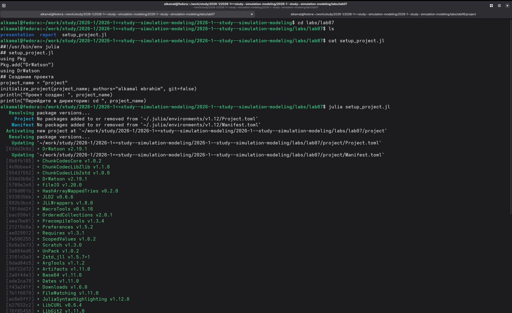
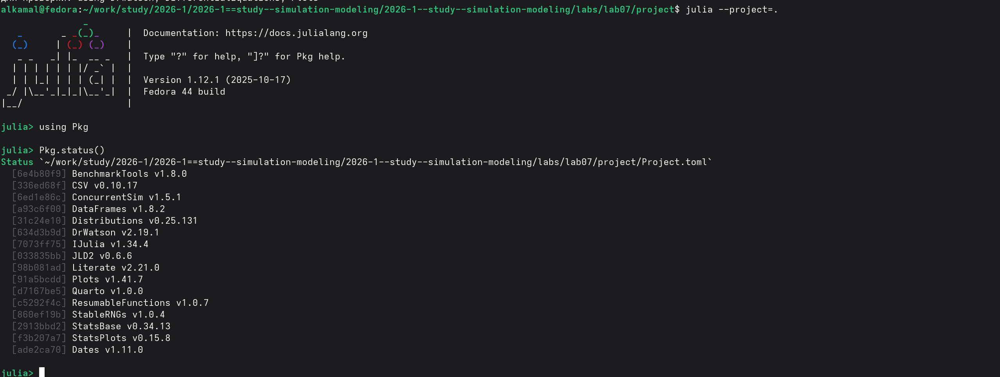
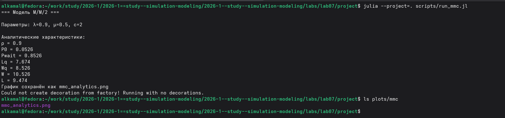
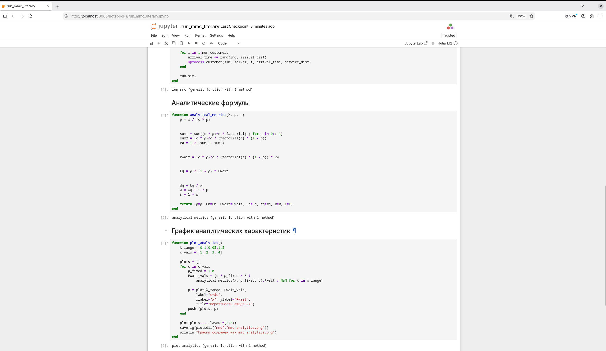
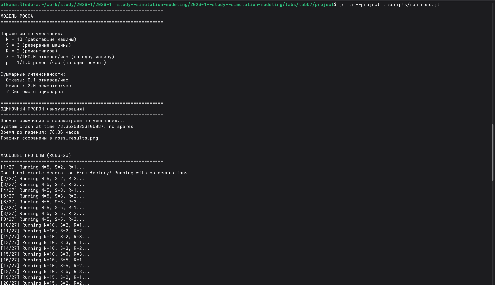
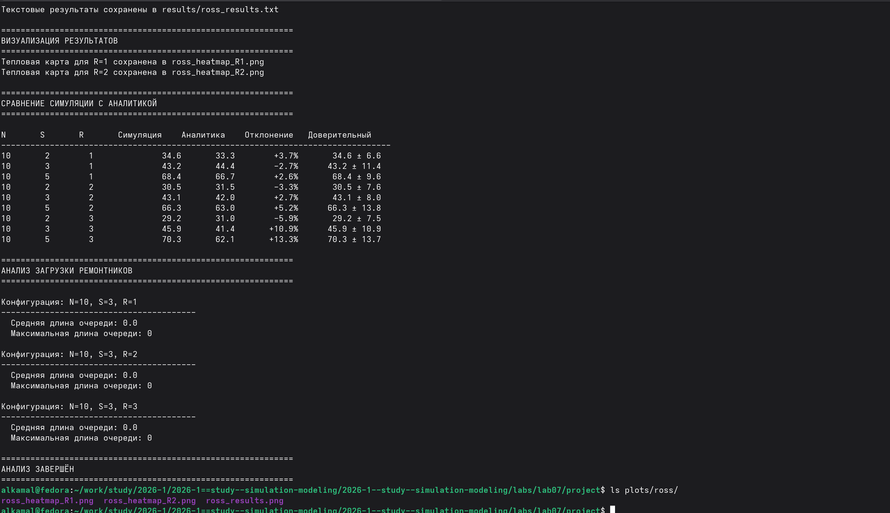
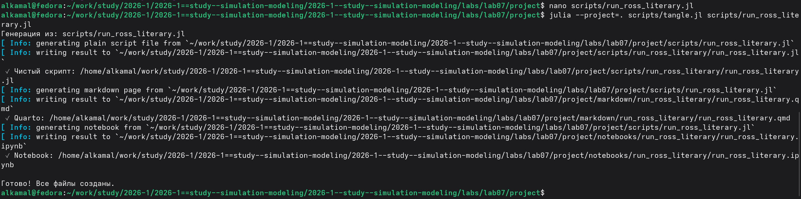
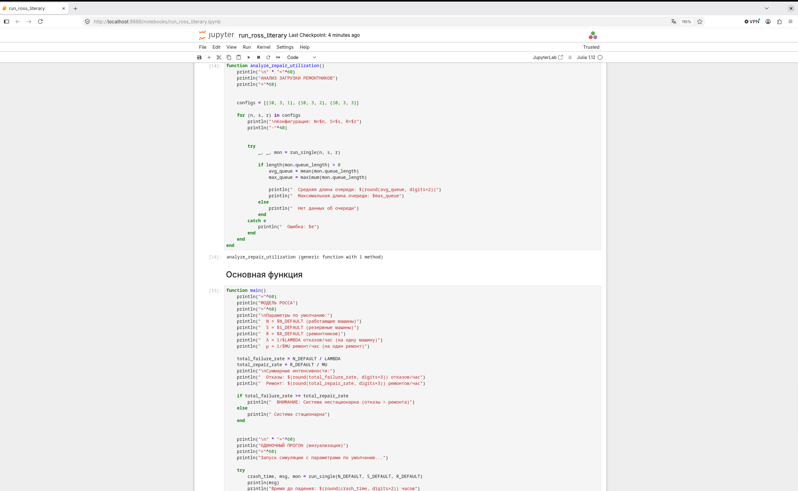

---
## Author
author:
  name: Ибрахим Мохсейн Алькамаль
  degrees: Student (3 курс)
  orcid: ""
  email: 1032225432@rudn.ru
  affiliation:
    - name: Российский университет дружбы народов
      country: Российская Федерация
      postal-code: 117198
      city: Москва
      address: ул. Миклухо-Маклая, д. 6

## Title
title: "Отчёт по лабораторной работе №7"
subtitle: "Имитационное моделирование"
license: "CC BY"
---

# Цель работы

Изучить принципы дискретно-событийного моделирования на примере систем массового обслуживания. Реализовать и исследовать модель M/M/c и модель Росса, выполнить моделирование, рассчитать основные характеристики систем и сравнить результаты симуляции с аналитическими значениями.

# Выполнение лабораторной работы

## Подготовка рабочего проекта

Для выполнения лабораторной работы был создан проект `lab07/project` с помощью скрипта `setup_project.jl`. При запуске скрипта сформировано проектное окружение Julia и установлена зависимость `DrWatson` ([рис. @fig-1]).

{#fig-1 width=70%}

## Проверка проектного окружения

Проект запущен командой `julia --project=.`. С помощью `Pkg.status()` проверено наличие установленных пакетов, включая `ConcurrentSim`, `Distributions`, `ResumableFunctions`, `StableRNGs`, `DataFrames` и `Plots` ([рис. @fig-2]).

{#fig-2 width=70%}

## Выполнение модели M/M/c

Выполнен скрипт `run_mmc.jl` для модели `M/M/2` с параметрами $\lambda=0.9$, $\mu=0.5$ и $c=2$. Рассчитаны аналитические характеристики системы, а полученный график сохранён в файле `plots/mmc/mmc_analytics.png` ([рис. @fig-3]).

{#fig-3 width=70%}

## Преобразование модели M/M/c в литературный стиль

С помощью скрипта `tangle.jl` обработан литературный файл `run_mmc_literary.jl`. Автоматически сформированы чистый Julia-скрипт, документ Quarto и Jupyter Notebook ([рис. @fig-4]).

{#fig-4 width=70%}

## Выполнение модели M/M/c в Jupyter Notebook

Сгенерированный `run_mmc_literary.ipynb` открыт и выполнен в Jupyter Notebook. В ноутбуке представлены функции расчёта аналитических характеристик модели и построения соответствующих графиков ([рис. @fig-5]).

{#fig-5 width=70%}

## Выполнение модели Росса

Выполнен скрипт `run_ross.jl` для моделирования системы Росса. При параметрах по умолчанию `N = 10`, `S = 3`, `R = 2`, $\lambda = 1/100$ и $\mu = 1/1.0$ система определена как стационарная. В одиночном прогоне получено время до падения `78.36` часов, после чего запущены массовые прогоны для различных конфигураций модели ([рис. @fig-6]).

{#fig-6 width=70%}

## Анализ результатов моделирования Росса

После массовых прогонов выполнены визуализация и сравнение результатов симуляции с аналитическими значениями. Сформированы тепловые карты для `R = 1` и `R = 2`, а также проведён анализ загрузки ремонтников. Результирующие графики сохранены в каталоге `plots/ross` ([рис. @fig-7]).

{#fig-7 width=70%}

## Преобразование модели Росса в литературный стиль

Для документирования модели подготовлен файл `run_ross_literary.jl`. С помощью `tangle.jl` автоматически сформированы чистый Julia-скрипт, документ Quarto и Jupyter Notebook ([рис. @fig-8]).

{#fig-8 width=70%}

## Выполнение модели Росса в Jupyter Notebook

Сгенерированный `run_ross_literary.ipynb` выполнен в Jupyter Notebook. В ноутбуке представлены функции анализа загрузки ремонтников и основная функция запуска модели с заданными параметрами и проверкой стационарности системы ([рис. @fig-9]).

{#fig-9 width=70%}




# Выводы

В ходе лабораторной работы были реализованы и исследованы дискретно-событийные модели M/M/c и Росса. Для модели M/M/c рассчитаны аналитические характеристики и построены соответствующие графики. Для модели Росса выполнены одиночный и массовые прогоны, проведено сравнение результатов симуляции с аналитическими значениями и исследована загрузка ремонтников. Результаты представлены в виде графиков и тепловых карт. Для обеих моделей также подготовлены литературные версии программ в форматах Quarto и Jupyter Notebook.