---
## Author
author:
  name: Ибрахим Мохсейн Алькамаль
  degrees: Student (3 курс)
  orcid: ""
  email: 1032225432@rudn.ru
  affiliation:
    - name: Российский университет дружбы народов
      country: Российская Федерация
      postal-code: 117198
      city: Москва
      address: ул. Миклухо-Маклая, д. 6
## Title
title: Лабораторная работа №8
subtitle: Имитационное моделирование
license: CC BY
date: today
date-format: "YYYY-MM-DD" # Example: 2025-09-06
---

# Информация

## Докладчик

:::::::::::::: {.columns align=center}
::: {.column width="70%"}

  - Ибрахим Мохсейн Алькамаль
  - Российский университет дружбы народов

:::
::: {.column width="30%"}

:::
::::::::::::::

# Цель работы

- Изучить принципы реализации эпидемиологических моделей в дискретно-событийном подходе.
- Реализовать и исследовать модели SIR и SEIR.
- Провести анализ чувствительности модели к изменению параметров.
- Исследовать влияние продолжительности заболевания, демографических процессов и вакцинации.
- Оценить производительность модели.
- Визуализировать результаты моделирования.

# Выполнение лабораторной работы

## Подготовка рабочего проекта

- Создан проект `lab08/project`.
- Скрипт `setup_project.jl` запущен в каталоге `lab08`.
- Сформировано проектное окружение Julia.
- Установлена зависимость `DrWatson`.

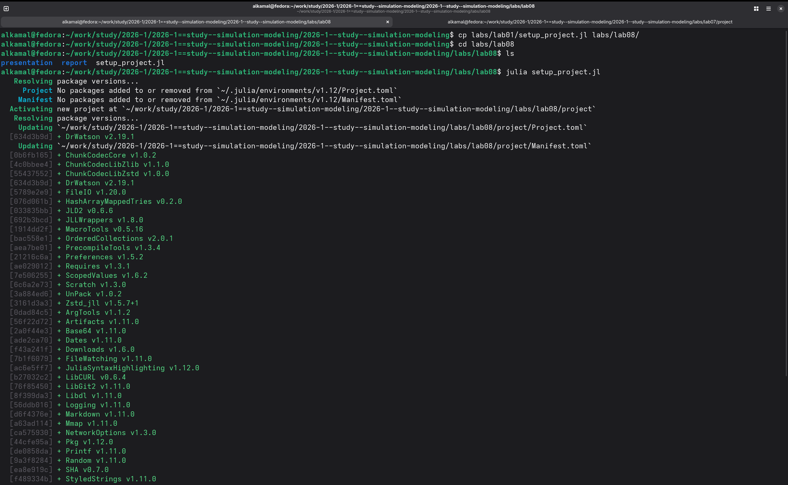{#fig-1 width=70%}

## Проверка проектного окружения

- Проект запущен командой `julia --project=.`.
- С помощью `Pkg.status()` проверены установленные пакеты.
- Проверено наличие пакетов для дискретно-событийного моделирования.

{#fig-2 width=70%}

## Выполнение дискретно-событийной модели SIR

- Подготовлены файлы `src/sir_model.jl` и `scripts/sir_des.jl`.
- Выполнен основной скрипт модели SIR.
- Построен график результатов моделирования.
- График сохранён в `plots/sir_des.png`.

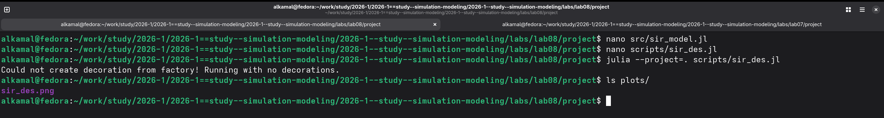{#fig-3 width=70%}

## Преобразование модели SIR в литературный стиль

- Подготовлен литературный файл `sir_des_literary.jl`.
- Файл обработан с помощью `tangle.jl`.
- Автоматически сформирован чистый Julia-скрипт.
- Сформированы документ Quarto и Jupyter Notebook.

{#fig-4 width=70%}

## Выполнение модели SIR в Jupyter Notebook

- Выполнен сгенерированный `sir_des_literary.ipynb`.
- Получена таблица значений `t`, `S`, `I`, `R`.
- Построен график изменения состояний модели во времени.
- Отображена динамика восприимчивых, инфицированных и выздоровевших.

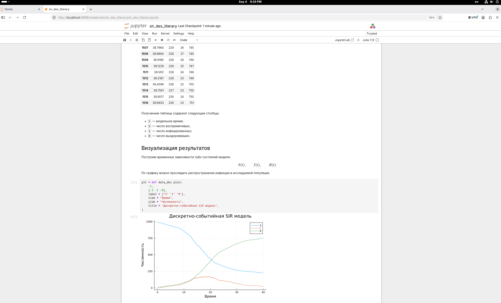{#fig-5 width=70%}

## Исследование чувствительности модели к коэффициенту заражения

- Выполнен скрипт `sir_sensitivity.jl`.
- Исследовано влияние коэффициента заражения $\beta$.
- Проведены эксперименты для $\beta = 0.03$, $0.05$ и $0.07$.
- Определены максимальное число инфицированных и время достижения пика.
- Определено конечное число выздоровевших.
- Полученные графики сохранены в каталоге `plots`.

---

{#fig-6 width=70%}

## Преобразование анализа чувствительности в литературный стиль

- Подготовлен файл `sir_sensitivity_literary.jl`.
- Файл обработан с помощью `tangle.jl`.
- Автоматически сформирован чистый Julia-скрипт.
- Сформированы документ Quarto и Jupyter Notebook.

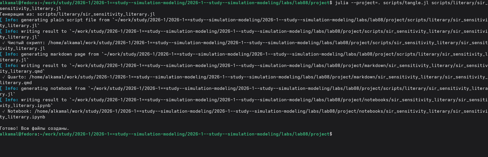{#fig-7 width=70%}

## Выполнение анализа чувствительности в Jupyter Notebook

- Выполнен `sir_sensitivity_literary.ipynb`.
- Получены показатели `peak I`, `peak time` и `final R`.
- Результаты получены для трёх значений $\beta$.
- Сформированы графики `sir_beta_0.03.png`, `sir_beta_0.05.png` и `sir_beta_0.07.png`.

{#fig-8 width=70%}

## Сравнение случайной и фиксированной длительности болезни

- Создан файл `sir_model_fixed.jl` на основе базовой модели.
- Подготовлен скрипт `sir_compare_duration.jl`.
- Выполнено сравнение двух вариантов длительности болезни.
- Сформирован график `sir_duration_comparison.png`.
- График сохранён в каталоге `plots`.

---

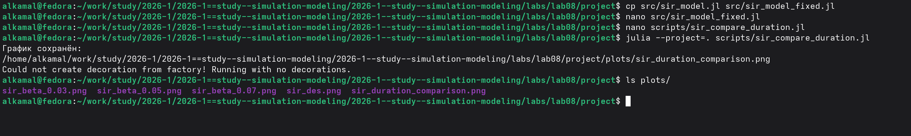{#fig-9 width=70%}

## Преобразование сравнения длительности болезни в литературный стиль

- Подготовлен файл `sir_compare_duration_literary.jl`.
- Файл обработан с помощью `tangle.jl`.
- Автоматически сформирован чистый Julia-скрипт.
- Сформированы документ Quarto и Jupyter Notebook.

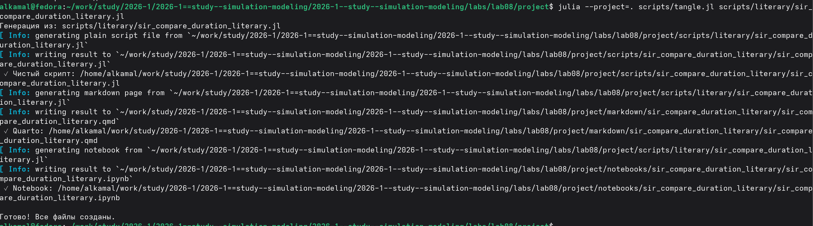{#fig-10 width=70%}

## Анализ сравнения в Jupyter Notebook

- Выполнен `sir_compare_duration_literary.ipynb`.
- На одном графике представлены два варианта модели.
- Первый вариант использует случайную длительность болезни.
- Второй вариант использует фиксированную длительность инфекционного периода.
- Выполнено визуальное сравнение динамики числа инфицированных.

---

{#fig-11 width=70%}

## Оценка производительности дискретно-событийной SIR-модели

- Выполнен скрипт `sir_benchmark.jl`.
- Тестирование проведено для `N = 10000`.
- Использован пакет `BenchmarkTools`.
- Оценены время выполнения, использование памяти и количество выделений.

{#fig-12 width=70%}

## Преобразование теста производительности в литературный стиль

- Подготовлен файл `sir_benchmark_literary.jl`.
- Выполнена обработка с помощью `tangle.jl`.
- Сформированы Julia-скрипт, документ Quarto и Jupyter Notebook.

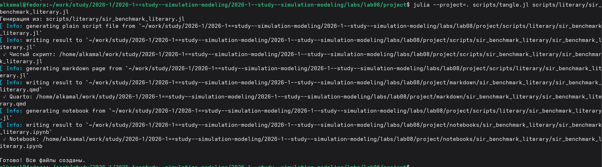{#fig-13 width=70%}

## Выполнение теста производительности в Jupyter Notebook

- Выполнен `sir_benchmark_literary.ipynb`.
- Тестирование проведено для `N = 10000`.
- Получены результаты `BenchmarkTools.Trial`.
- Представлены показатели времени, памяти и количества выделений.

{#fig-14 width=70%}

## Сохранение результатов SIR-модели в формате CSV

- В скрипт `sir_des.jl` добавлено автоматическое сохранение результатов.
- CSV-файлы сохраняются в каталог `data/sims`.
- Имя файла формируется из начальных условий и параметров модели.

{#fig-15 width=70%}

## Проверка сохранения результатов моделирования

- Создан файл `sir_990_10_0.05_10.0_0.25.csv`.
- Содержимое проверено командой `head`.
- Файл содержит столбцы `t`, `S`, `I` и `R`.

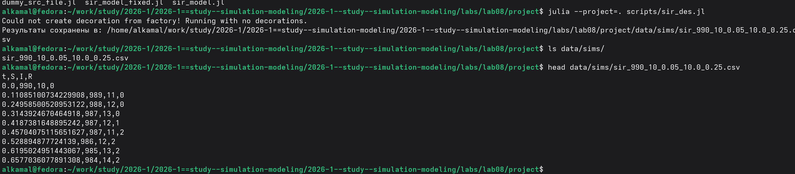{#fig-16 width=70%}

## Реализация SIR-модели с демографическими событиями

- Выполнен скрипт `sir_demography.jl`.
- Реализована модель с демографическими событиями.
- Получено `2531` наблюдение.
- Таблица содержит столбцы `t`, `S`, `I`, `R` и `D`.

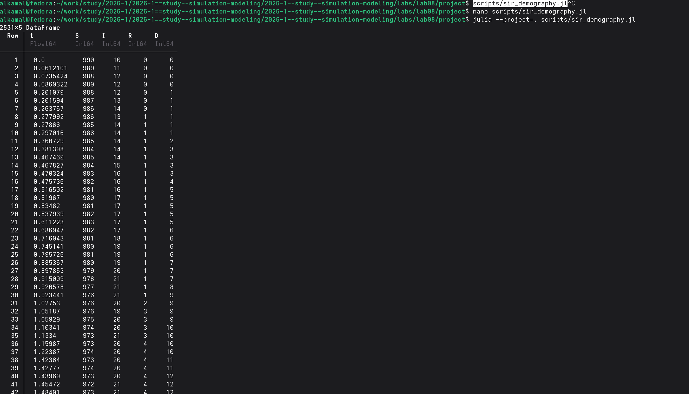{#fig-17 width=70%}

## Сохранение результатов модели с демографическими событиями

- Результаты сохранены в CSV-файл в каталоге `data/sims`.
- График сохранён в `plots/sir_demography.png`.
- Наличие файлов проверено командами `ls`.

{#fig-18 width=70%}

## Преобразование модели с демографическими событиями в литературный стиль

- Подготовлен файл `sir_demography_literary.jl`.
- Выполнена обработка с помощью `tangle.jl`.
- Сформированы Julia-скрипт, документ Quarto и Jupyter Notebook.

{#fig-19 width=70%}

## Выполнение модели с демографическими событиями в Jupyter Notebook

- Выполнен `sir_demography_literary.ipynb`.
- Представлена таблица результатов.
- Построен график динамики `S`, `I`, `R` и `D`.

{#fig-20 width=70%}

## Реализация вакцинации в SIR-модели

- Созданы `sir_model_vaccination.jl` и `sir_vaccination.jl`.
- Вакцинация выполняется при `t = 10.0`.
- Вакцинируются `50 %` восприимчивых агентов.
- После моделирования выводятся основные показатели.
- Сохраняется график `sir_vaccination.png`.

---

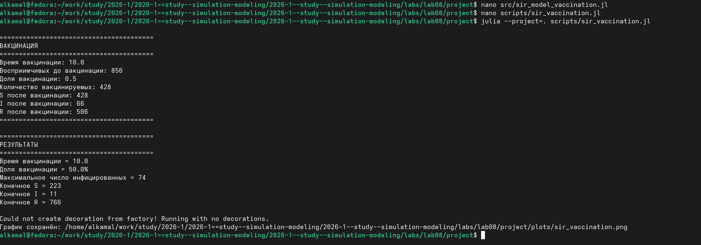{#fig-21 width=70%}

## Преобразование модели вакцинации в литературный стиль

- Подготовлен файл `sir_vaccination_literary.jl`.
- Выполнена обработка с помощью `tangle.jl`.
- Сформированы Julia-скрипт, документ Quarto и Jupyter Notebook.

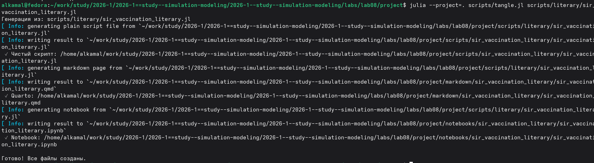{#fig-22 width=70%}

## Выполнение модели вакцинации в Jupyter Notebook

- Выполнен `sir_vaccination_literary.ipynb`.
- Построены графики динамики `S`, `I` и `R`.
- Момент вакцинации отмечен при `t = 10`.

{#fig-23 width=70%}

## Реализация SEIR-модели

- Создан файл `src/seir_model.jl`.
- В модель добавлено состояние `E` — латентная стадия заболевания.
- Подготовлен скрипт `scripts/seir_run.jl`.
- Начальное состояние: \(S_0=990\), \(E_0=0\), \(I_0=10\), \(R_0=0\).
- Средний латентный период — 2 единицы времени.
- Средняя продолжительность болезни — 4 единицы времени.
- Максимальное число инфицированных — 110.
- Пик достигнут при \(t=31.296\).
- Итоговая численность населения — 1000.

---

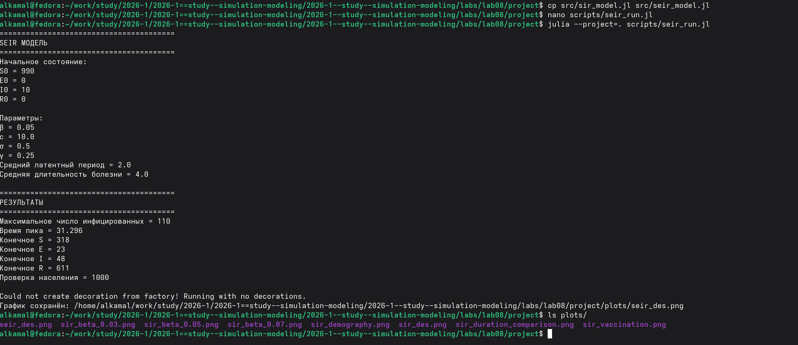{#fig-24 width=70%}

## Преобразование SEIR-модели в литературный стиль

- Подготовлен `scripts/literary/seir_run_literary.jl`.
- Выполнена обработка с помощью `tangle.jl`.
- Сформированы Julia-скрипт, документ Quarto и Jupyter Notebook.

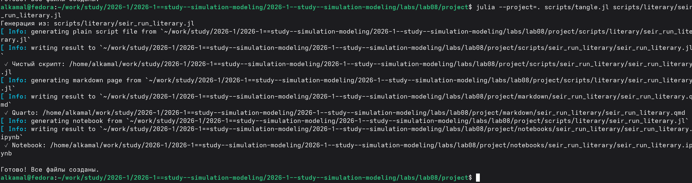{#fig-25 width=70%}

## Выполнение SEIR-модели в Jupyter Notebook

- Выполнен `seir_run_literary.ipynb`.
- Построены временные зависимости \(S(t)\), \(E(t)\), \(I(t)\) и \(R(t)\).
- Визуализирована динамика переходов населения между состояниями.

{#fig-26 width=70%}

# Выводы

- Реализованы и исследованы дискретно-событийные модели SIR и SEIR.
- Исследовано влияние коэффициента заражения \(\beta\) на показатели эпидемии.
- Сравнены случайная и фиксированная продолжительности заболевания.
- SIR-модель расширена демографическими событиями.
- Реализован сценарий вакцинации.
- В SEIR-модель добавлено латентное состояние \(E\).
- Производительность модели оценена с помощью `BenchmarkTools`.
- Результаты сохранены в CSV-файлах и представлены графически.
- Подготовлены литературные версии программ в форматах Quarto и Jupyter Notebook.
- Исследовано влияние параметров, структуры модели и внешних воздействий на динамику эпидемии.