---
## Author
author:
  name: Ибрахим Мохсейн Алькамаль
  degrees: Student (3 курс)
  orcid: ""
  email: 1032225432@rudn.ru
  affiliation:
    - name: Российский университет дружбы народов
      country: Российская Федерация
      postal-code: 117198
      city: Москва
      address: ул. Миклухо-Маклая, д. 6

## Title
title: "Отчёт по лабораторной работе №8"
subtitle: "Имитационное моделирование"
license: "CC BY"
---

# Цель работы

Изучить принципы реализации основных эпидемиологических моделей в дискретно-событийном подходе. Реализовать и исследовать дискретно-событийные модели SIR и SEIR, провести анализ чувствительности модели к изменению параметров, исследовать влияние продолжительности заболевания, демографических процессов и вакцинации на динамику эпидемии. Выполнить оценку производительности разработанной модели и визуализировать результаты моделирования.

# Выполнение лабораторной работы

## Подготовка рабочего проекта

Для выполнения лабораторной работы был создан проект `lab08/project`. Скрипт `setup_project.jl` запущен в каталоге `lab08`, после чего сформировано проектное окружение Julia и установлена зависимость `DrWatson` ([рис. @fig-1]).

{#fig-1 width=70%}

## Проверка проектного окружения

Проект запущен командой `julia --project=.`. С помощью `Pkg.status()` проверено наличие установленных пакетов, необходимых для выполнения дискретно-событийного моделирования ([рис. @fig-2]).

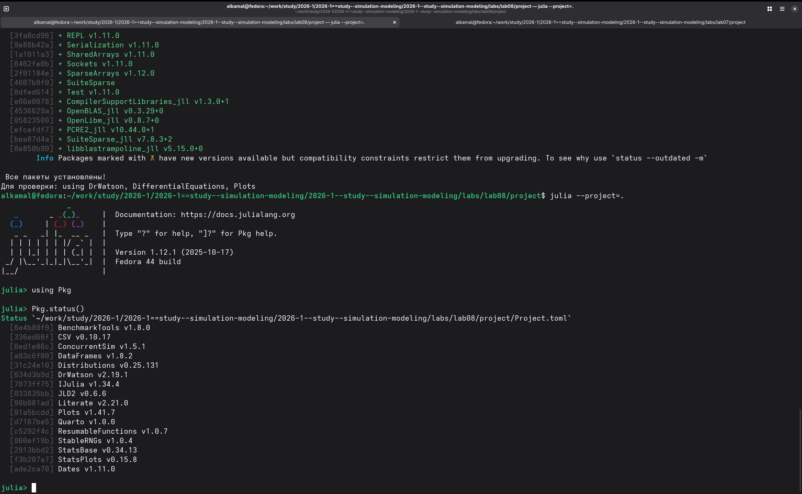{#fig-2 width=70%}

## Выполнение дискретно-событийной модели SIR

После подготовки файлов `src/sir_model.jl` и `scripts/sir_des.jl` выполнен основной скрипт модели. В результате моделирования построен и сохранён график `plots/sir_des.png` ([рис. @fig-3]).

{#fig-3 width=70%}

## Преобразование модели SIR в литературный стиль

Литературный файл `sir_des_literary.jl` обработан с помощью скрипта `tangle.jl`. Автоматически сформированы чистый Julia-скрипт, документ Quarto и Jupyter Notebook ([рис. @fig-4]).

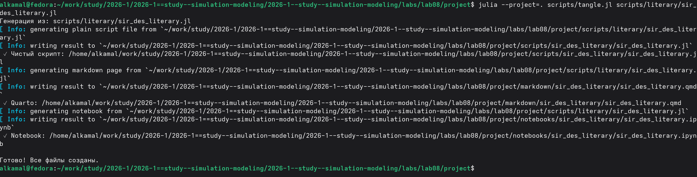{#fig-4 width=70%}

## Выполнение модели SIR в Jupyter Notebook

Сгенерированный `sir_des_literary.ipynb` выполнен в Jupyter Notebook. Получена таблица значений `t`, `S`, `I`, `R` и построен график изменения численности восприимчивых, инфицированных и выздоровевших во времени ([рис. @fig-5]).

{#fig-5 width=70%}

## Исследование чувствительности модели к коэффициенту заражения

Для анализа влияния коэффициента заражения $\beta$ выполнен скрипт `sir_sensitivity.jl`. Проведены эксперименты для значений $\beta = 0.03$, $0.05$ и $0.07`. Для каждого варианта определены максимальное число инфицированных, время достижения пика и конечное число выздоровевших. Полученные графики сохранены в каталоге `plots` ([рис. @fig-6]).

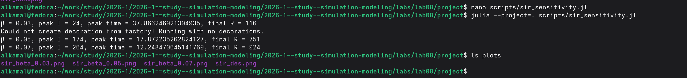{#fig-6 width=70%}

## Преобразование анализа чувствительности в литературный стиль

Литературный файл `sir_sensitivity_literary.jl` обработан с помощью скрипта `tangle.jl`. В результате автоматически сформированы чистый Julia-скрипт, документ Quarto и Jupyter Notebook ([рис. @fig-7]).

{#fig-7 width=70%}

## Выполнение анализа чувствительности в Jupyter Notebook

Сгенерированный `sir_sensitivity_literary.ipynb` выполнен в Jupyter Notebook. Для трёх значений $\beta$ получены показатели `peak I`, `peak time` и `final R`, а также сформированы соответствующие графики `sir_beta_0.03.png`, `sir_beta_0.05.png` и `sir_beta_0.07.png` ([рис. @fig-8]).

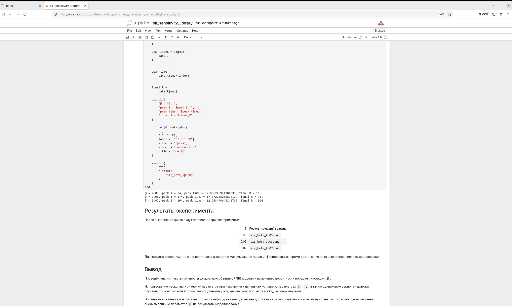{#fig-8 width=70%}

## Сравнение случайной и фиксированной длительности болезни

Для сравнения вариантов модели создан файл `sir_model_fixed.jl` на основе базовой реализации и подготовлен скрипт `sir_compare_duration.jl`. После выполнения скрипта сформирован график `sir_duration_comparison.png`, сохранённый в каталоге `plots` ([рис. @fig-9]).

{#fig-9 width=70%}

## Преобразование сравнения длительности болезни в литературный стиль

Для документирования эксперимента подготовлен файл `sir_compare_duration_literary.jl`. С помощью `tangle.jl` автоматически сформированы чистый Julia-скрипт, документ Quarto и Jupyter Notebook ([рис. @fig-10]).

{#fig-10 width=70%}

## Анализ сравнения в Jupyter Notebook

Сгенерированный `sir_compare_duration_literary.ipynb` выполнен в Jupyter Notebook. На одном графике представлены зависимости числа инфицированных для модели со случайной длительностью болезни и модели с фиксированной длительностью инфекционного периода, что позволяет визуально сравнить их динамику ([рис. @fig-11]).

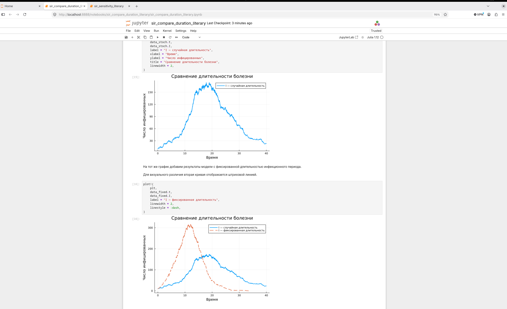{#fig-11 width=70%}

## Оценка производительности дискретно-событийной SIR-модели

Для оценки производительности выполнен скрипт `sir_benchmark.jl`. Тестирование проведено для популяции размером `N = 10000` с использованием `BenchmarkTools`. В результате получены характеристики времени выполнения, использования памяти и количества выделений памяти ([рис. @fig-12]).

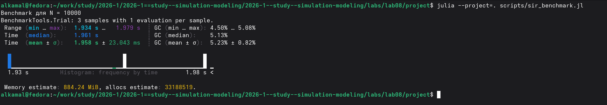{#fig-12 width=70%}

## Преобразование теста производительности в литературный стиль

Для документирования тестирования подготовлен файл `sir_benchmark_literary.jl`. С помощью `tangle.jl` автоматически сформированы чистый Julia-скрипт, документ Quarto и Jupyter Notebook ([рис. @fig-13]).

{#fig-13 width=70%}

## Выполнение теста производительности в Jupyter Notebook

Сгенерированный `sir_benchmark_literary.ipynb` выполнен в Jupyter Notebook. Для популяции `N = 10000` проведено измерение производительности модели и представлены результаты `BenchmarkTools.Trial`, включающие время выполнения, использование памяти и количество выделений памяти ([рис. @fig-14]).

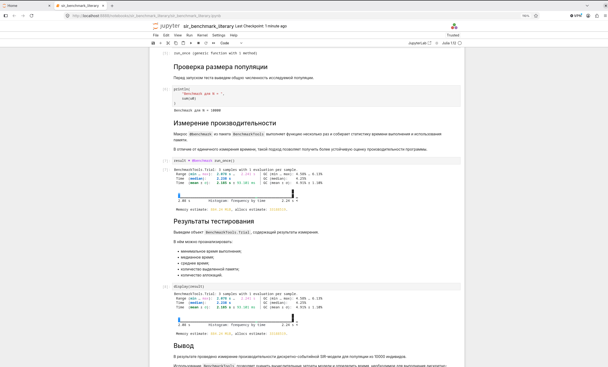{#fig-14 width=70%}

## Сохранение результатов SIR-модели в формате CSV

В скрипт `sir_des.jl` добавлено автоматическое сохранение результатов моделирования в каталог `data/sims`. Имя CSV-файла формируется на основе начальных условий и параметров модели ([рис. @fig-15]).

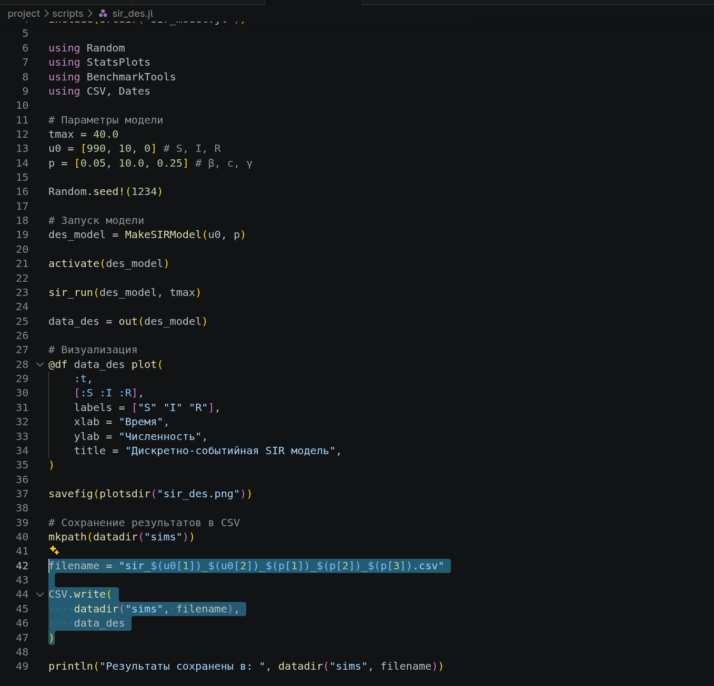{#fig-15 width=70%}

## Проверка сохранения результатов моделирования

После выполнения `sir_des.jl` создан файл `sir_990_10_0.05_10.0_0.25.csv`. Командой `head` проверено его содержимое: файл содержит столбцы `t`, `S`, `I` и `R` с результатами моделирования ([рис. @fig-16]).

{#fig-16 width=70%}

## Реализация SIR-модели с демографическими событиями

Выполнен скрипт `sir_demography.jl`, реализующий модель с демографическими событиями. Результат представлен в виде таблицы из `2531` наблюдения со столбцами `t`, `S`, `I`, `R` и `D` ([рис. @fig-17]).

{#fig-17 width=70%}

## Сохранение результатов модели с демографическими событиями

По завершении моделирования результаты сохранены в CSV-файл в каталоге `data/sims`, а построенный график — в `plots/sir_demography.png`. Наличие созданных файлов проверено командами `ls` ([рис. @fig-18]).

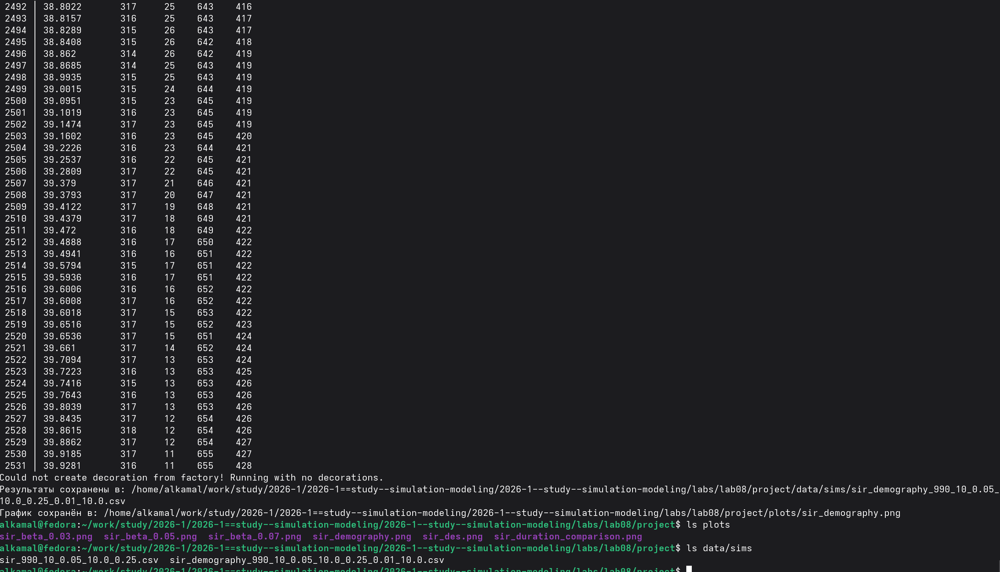{#fig-18 width=70%}

## Преобразование модели с демографическими событиями в литературный стиль

Для модели подготовлен файл `sir_demography_literary.jl`. С помощью `tangle.jl` автоматически сформированы чистый Julia-скрипт, документ Quarto и Jupyter Notebook ([рис. @fig-19]).

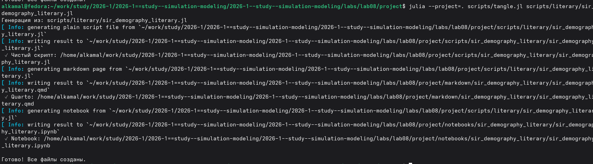{#fig-19 width=70%}

## Выполнение модели с демографическими событиями в Jupyter Notebook

Сгенерированный `sir_demography_literary.ipynb` выполнен в Jupyter Notebook. Представлены таблица результатов и график динамики состояний `S`, `I`, `R` и `D` во времени ([рис. @fig-20]).

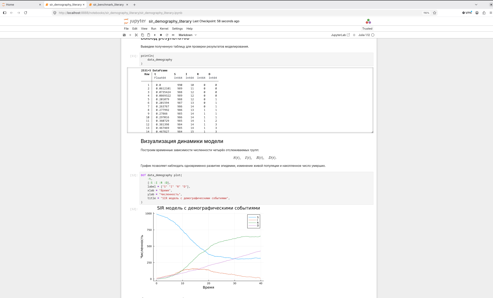{#fig-20 width=70%}

## Реализация вакцинации в SIR-модели

Созданы файл модели `sir_model_vaccination.jl` и скрипт `sir_vaccination.jl`. При выполнении моделирования вакцинация проводится в момент времени `10.0` для `50 %` восприимчивых агентов; после расчёта выводятся основные показатели и сохраняется график `sir_vaccination.png` ([рис. @fig-21]).

{#fig-21 width=70%}

## Преобразование модели вакцинации в литературный стиль

Для документирования эксперимента подготовлен файл `sir_vaccination_literary.jl`. С помощью `tangle.jl` автоматически сформированы чистый Julia-скрипт, документ Quarto и Jupyter Notebook ([рис. @fig-22]).

{#fig-22 width=70%}

## Выполнение модели вакцинации в Jupyter Notebook

Сгенерированный `sir_vaccination_literary.ipynb` выполнен в Jupyter Notebook. Построены графики динамики состояний `S`, `I` и `R`, а момент вакцинации отмечен вертикальной штриховой линией при `t = 10` ([рис. @fig-23]).

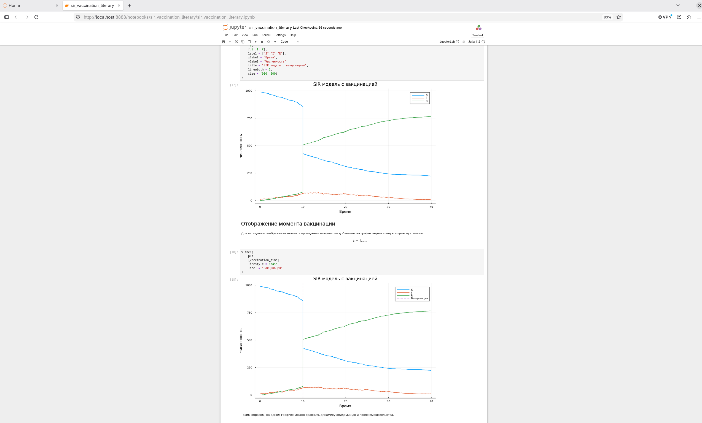{#fig-23 width=70%}

## Реализация SEIR-модели

На основе исходной SIR-модели создан файл `src/seir_model.jl`, в котором модель расширена дополнительным состоянием `E` — группой инфицированных индивидов, находящихся в латентной стадии заболевания. Для запуска модели подготовлен скрипт `scripts/seir_run.jl`. Моделирование выполнено для начального состояния \(S_0=990\), \(E_0=0\), \(I_0=10\), \(R_0=0\). Средний латентный период составил 2 единицы времени, а средняя продолжительность заболевания — 4 единицы времени. По результатам моделирования максимальное число инфицированных составило 110 человек и было достигнуто в момент времени \(t=31.296\). Итоговая численность населения сохранилась равной 1000 ([рис. @fig-24]).

{#fig-24 width=70%}

## Преобразование SEIR-модели в литературный стиль

Для документирования реализации подготовлен литературный скрипт `scripts/literary/seir_run_literary.jl`. С помощью скрипта `tangle.jl` из него автоматически сформированы чистый Julia-скрипт, документ Quarto и Jupyter Notebook. Успешное создание всех файлов показано на [рис. @fig-25].

{#fig-25 width=70%}

## Выполнение SEIR-модели в Jupyter Notebook

Сгенерированный файл `seir_run_literary.ipynb` выполнен в Jupyter Notebook. На графике представлены временные зависимости всех четырёх состояний модели: восприимчивых \(S(t)\), находящихся в латентной стадии \(E(t)\), инфицированных \(I(t)\) и выздоровевших \(R(t)\). Полученная визуализация позволяет проследить переход населения между состояниями в процессе развития эпидемии ([рис. @fig-26]).

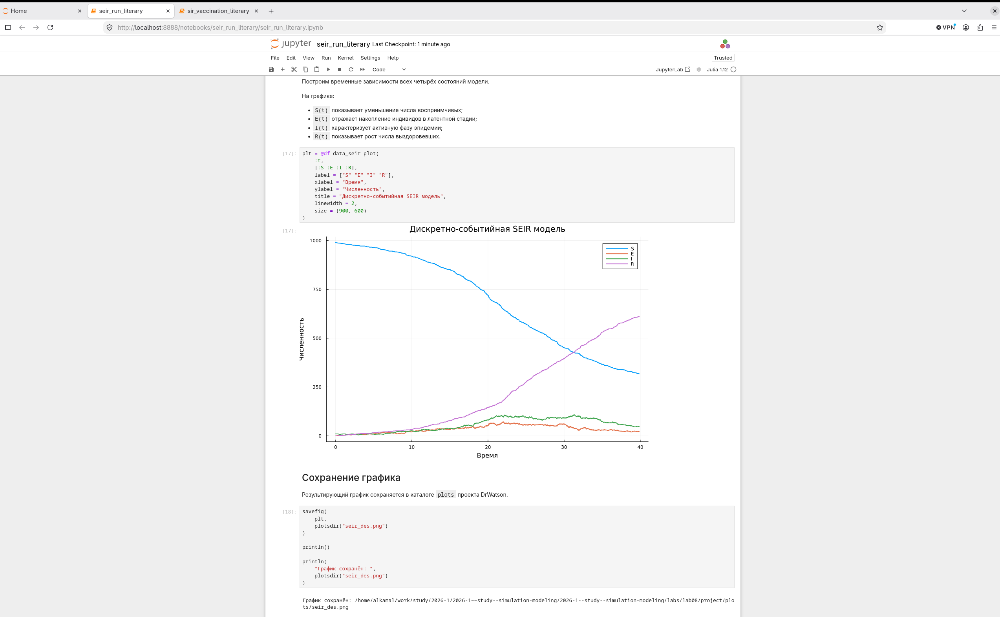{#fig-26 width=70%}









# Выводы

В ходе лабораторной работы были изучены методы реализации эпидемиологических моделей с использованием дискретно-событийного подхода. Была реализована базовая SIR-модель, позволяющая моделировать переходы между состояниями восприимчивых, инфицированных и выздоровевших индивидов.

Проведён анализ чувствительности модели к изменению вероятности передачи инфекции \(\beta\). Полученные результаты показали, что изменение данного параметра существенно влияет на максимальное число инфицированных, время достижения пика эпидемии и итоговое число выздоровевших.

Были рассмотрены варианты модели со случайной и фиксированной продолжительностью заболевания. Сравнение показало, что способ задания длительности инфекционного периода заметно изменяет форму и величину эпидемического пика.

Модель была расширена демографическими событиями, что позволило учитывать изменения численности населения в процессе моделирования. Также был реализован сценарий вакцинации, при котором часть восприимчивых индивидов переводится в группу выздоровевших (иммунных) в заданный момент времени. Это позволило исследовать влияние вмешательства на дальнейшее развитие эпидемии.

Для более подробного описания стадий заболевания была реализована SEIR-модель с дополнительным состоянием \(E\), соответствующим латентному периоду. Моделирование продемонстрировало динамику переходов между состояниями \(S\), \(E\), \(I\) и \(R\).

Дополнительно с помощью BenchmarkTools была проведена оценка производительности дискретно-событийной модели. Результаты моделирования сохранялись в CSV-файлы и представлялись графически. Для разработанных программ были подготовлены литературные версии, а также автоматически сформированы документы Quarto и Jupyter Notebook.

Таким образом, в лабораторной работе были практически исследованы возможности дискретно-событийного моделирования эпидемиологических процессов и показано влияние структуры модели, её параметров и внешних воздействий на результаты моделирования.